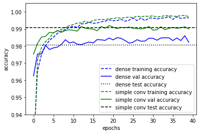
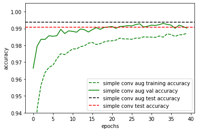
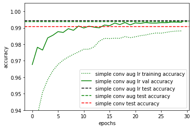

```python
from tensorflow import keras

from sklearn.model_selection import train_test_split
import numpy as np
import matplotlib.pyplot as plt

from keras.models import Sequential
from keras.layers import Dense, Dropout, Flatten, Conv2D, MaxPool2D
from keras.optimizers import RMSprop
from keras.preprocessing.image import ImageDataGenerator
from keras.callbacks import ReduceLROnPlateau
```

# Convolutional Neural Networks

In the lectures, we have been introduced to a variety of neural network layers: 1) dense layers, 2) dropout layers, 3) convolutional layers and 4) pooling layers. With this set of layers, it is already possible to achieve new state-of-the-art performance i.e. $\geq$ 99.7% accuracy on the MNIST dataset. In this exercise, we will walk through an example of a simple convolutional network with the main objective of familiarising oneself with a general machine learning workflow.

First let us load and prepare the data set. Notice that we have split the data into training, validation and testing sets. In addition, we have reshaped the images to include an additional dimension which is required for convolutional layers. Convolutional layers take as input images from one or more channels and output images to one or more channels. The additional dimension stores the information from these multiple channels.


```python
(x_train, y_train),(x_test, y_test) = keras.datasets.mnist.load_data()
x_train, x_test = x_train / 255.0, x_test / 255.0  

x_train = x_train.reshape(-1,28,28,1)
x_test = x_test.reshape(-1,28,28,1)

x_train, x_val, y_train, y_val = train_test_split(
	x_train, y_train, test_size = 1/6, random_state=42)

print('x_train.shape =', x_train.shape)
print('y_train.shape =', y_train.shape)
print('x_val.shape =', x_val.shape)
print('y_val.shape =', y_val.shape)
print('x_test.shape =', x_test.shape)
print('y_test.shape =', y_test.shape)
```

    Downloading data from https://storage.googleapis.com/tensorflow/tf-keras-datasets/mnist.npz
    11493376/11490434 [==============================] - 0s 0us/step
    x_train.shape = (50000, 28, 28, 1)
    y_train.shape = (50000,)
    x_val.shape = (10000, 28, 28, 1)
    y_val.shape = (10000,)
    x_test.shape = (10000, 28, 28, 1)
    y_test.shape = (10000,)


## A simple convolutional network

In this first part, we simply want to try out a very simple convolutional neural network and compare its performance with a dense network with similar number of parameters.


```python
def make_conv_model():
  model = Sequential()

  model.add(Conv2D(filters = 10, kernel_size = (5,5),padding = 'Same', 
                  activation ='relu', input_shape = (28,28,1)))
  model.add(Conv2D(filters = 10, kernel_size = (5,5),padding = 'Same', 
                  activation ='relu'))
  model.add(MaxPool2D(pool_size=(2,2)))
  model.add(Flatten())
  model.add(Dense(64, activation = "relu"))
  model.add(Dropout(0.2))
  model.add(Dense(10, activation = "softmax"))
  optimizer = keras.optimizers.Adam()

  model.compile(optimizer=optimizer,
                loss='sparse_categorical_crossentropy',
                metrics=['accuracy']) 
  return model

def make_dense_model():
  model = Sequential()
  model.add(Flatten(input_shape = (28,28,1)))
  model.add(Dense(512, activation = "relu"))
  model.add(Dropout(0.2))
  model.add(Dense(256, activation = "relu"))
  model.add(Dropout(0.2))
  model.add(Dense(10, activation = "softmax"))
  optimizer = keras.optimizers.Adam()

  model.compile(optimizer=optimizer,
                loss='sparse_categorical_crossentropy',
                metrics=['accuracy']) 
  return model

simple_conv_model = make_conv_model()
dense_model = make_dense_model()
simple_conv_model.summary()
dense_model.summary()
```

    Model: "sequential"
    _________________________________________________________________
    Layer (type)                 Output Shape              Param #   
    =================================================================
    conv2d (Conv2D)              (None, 28, 28, 10)        260       
    _________________________________________________________________
    conv2d_1 (Conv2D)            (None, 28, 28, 10)        2510      
    _________________________________________________________________
    max_pooling2d (MaxPooling2D) (None, 14, 14, 10)        0         
    _________________________________________________________________
    flatten (Flatten)            (None, 1960)              0         
    _________________________________________________________________
    dense (Dense)                (None, 64)                125504    
    _________________________________________________________________
    dropout (Dropout)            (None, 64)                0         
    _________________________________________________________________
    dense_1 (Dense)              (None, 10)                650       
    =================================================================
    Total params: 128,924
    Trainable params: 128,924
    Non-trainable params: 0
    _________________________________________________________________
    Model: "sequential_1"
    _________________________________________________________________
    Layer (type)                 Output Shape              Param #   
    =================================================================
    flatten_1 (Flatten)          (None, 784)               0         
    _________________________________________________________________
    dense_2 (Dense)              (None, 512)               401920    
    _________________________________________________________________
    dropout_1 (Dropout)          (None, 512)               0         
    _________________________________________________________________
    dense_3 (Dense)              (None, 256)               131328    
    _________________________________________________________________
    dropout_2 (Dropout)          (None, 256)               0         
    _________________________________________________________________
    dense_4 (Dense)              (None, 10)                2570      
    =================================================================
    Total params: 535,818
    Trainable params: 535,818
    Non-trainable params: 0
    _________________________________________________________________


Now let us train the models and compare its validation and test accuracies.


```python
epochs = 40
batch_size = 86

simple_conv_history = simple_conv_model.fit(x_train, y_train, batch_size=batch_size, epochs=epochs, validation_data=(x_val, y_val), verbose=0)
dense_history = dense_model.fit(x_train, y_train, batch_size=batch_size, epochs=epochs, validation_data=(x_val, y_val),verbose=0)
```

Having trained the models, we can now evaluate and plot the accuracies on the validation and training sets.


```python
simple_conv_test_loss, simple_conv_test_acc = simple_conv_model.evaluate(x_test, y_test)
dense_test_loss, dense_test_acc = dense_model.evaluate(x_test, y_test)

plt.plot(dense_history.history["accuracy"], "b--",label="dense training accuracy")
plt.plot(dense_history.history["val_accuracy"], "b-",label="dense val accuracy")
plt.axhline(dense_test_acc, color="k", linestyle=":", label="dense test accuracy")
plt.plot(simple_conv_history.history["accuracy"], "g--",label="simple conv training accuracy")
plt.plot(simple_conv_history.history["val_accuracy"], "g-",label="simple conv val accuracy")
plt.axhline(simple_conv_test_acc,color="k", linestyle="--", label="simple conv test accuracy")
plt.xlabel("epochs")
plt.ylabel("accuracy")
plt.ylim(0.94, 1.005)
plt.legend()
```

    313/313 [==============================] - 1s 2ms/step - loss: 0.0432 - accuracy: 0.9907
    313/313 [==============================] - 1s 2ms/step - loss: 0.1149 - accuracy: 0.9806


    

    


We do indeed see that the validation accuracies are an extremely good approximation of the test accuracies as one would expect if the datasets were split randomly and each set still contains sufficient number of samples. However, in practice, if we were selecting hyperparameters based on the validation data, the accuracies would then be biased towards the validation set and then the true generalisation accuracy of the model should then be evaluated using the testing set. On the hand, we do see that models are overfitted since the training accuracies are exceeding the validation and test accuracies significantly.

On a separate note, we do see that the convolutional layers do improve the performance substantially despite having similar number of parameters. This is particular to this problem since image classification are often insensitive towards translations which are well handled by convolutional layers.

## Data Augmentation

It is obvious that with more data, we would be able to achieve better performances. One reason for this is that with more data, the problem of overfitting is reduced. Hence, there have been many elaborate schemes for expanding a dataset. For image classification tasks such as here, a common approach is simply to augment the data with small translations and rotations of the original data samples. This works for our case because we know that even if a digit is rotated and translated, the classification of that digit would not change. This can be done easily using the following function from keras.


```python
datagen = ImageDataGenerator(
        featurewise_center=False,  # set input mean to 0 over the dataset
        samplewise_center=False,  # set each sample mean to 0
        featurewise_std_normalization=False,  # divide inputs by std of the dataset
        samplewise_std_normalization=False,  # divide each input by its std
        zca_whitening=False,  # apply ZCA whitening
        rotation_range=10,  # randomly rotate images in the range (degrees)
        zoom_range = 0.1, # Randomly zoom image 
        width_shift_range=0.1,  # randomly shift images horizontally 
        height_shift_range=0.1,  # randomly shift images vertically 
        horizontal_flip=False,  # randomly flip images
        vertical_flip=False)  # randomly flip images

datagen.fit(x_train.reshape(-1,28,28,1))
```


```python
simple_conv_model = make_conv_model()

epochs = 40
batch_size = 86
simple_conv_aug_history = simple_conv_model.fit(
    datagen.flow(x_train,y_train, batch_size=batch_size),
    epochs = epochs, validation_data = (x_val,y_val),
    steps_per_epoch=x_train.shape[0]//batch_size, verbose=0)

```

Now lets reevaluate our test and validation accuracies.


```python
simple_conv_aug_test_loss, simple_conv_aug_test_acc = simple_conv_model.evaluate(x_test, y_test)


plt.plot(simple_conv_aug_history.history["accuracy"], "g--",label="simple conv aug training accuracy")
plt.plot(simple_conv_aug_history.history["val_accuracy"], "g-",label="simple conv aug val accuracy")
plt.axhline(simple_conv_aug_test_acc,color="k", linestyle="--", label="simple conv aug test accuracy")
plt.axhline(simple_conv_test_acc,color="r", linestyle="--", label="simple conv test accuracy")
plt.xlabel("epochs")
plt.ylabel("accuracy")
plt.ylim(0.94, 1.005)
plt.legend()
```

    313/313 [==============================] - 1s 2ms/step - loss: 0.0209 - accuracy: 0.9937


    

    


With the data set augmentation, we do indeed see some improvement in the final test or generalisation accuracy. Notice also that the training accuracy is now below the validation and test accuracy. This is because in each epoch, new data samples are generated via translations and rotations such that it is extremely difficult for the model to overfit.

## Learning rate reduction

To further improve accuracies, it can sometimes be helpful to reduce the learning as one approach convergence. There are many different scheme to achieve this. A common method is to monitor a certain metric, for instance the validation accuracy, and to reduce the learning rate when the chosen metric is not improving for a certain number of epochs. Here, we monitor the validation accuracy and reduce the learning rate by half when the accuracy is not improving after 3 epochs.


```python
learning_rate_reduction = ReduceLROnPlateau(monitor='val_accuracy', 
                                            patience=3, 
                                            verbose=1, 
                                            factor=0.5, 
                                            min_lr=0.00001)
```


```python
epochs = 30
batch_size = 86

simple_conv_model = make_conv_model()

simple_conv_aug_lr_history = simple_conv_model.fit(
    datagen.flow(x_train,y_train, batch_size=batch_size),
    epochs = epochs, validation_data = (x_val,y_val),
    steps_per_epoch=x_train.shape[0]//batch_size, 
    callbacks=[learning_rate_reduction],
    verbose=0)
```

    
    Epoch 00013: ReduceLROnPlateau reducing learning rate to 0.0005000000237487257.
    
    Epoch 00022: ReduceLROnPlateau reducing learning rate to 0.0002500000118743628.
    
    Epoch 00025: ReduceLROnPlateau reducing learning rate to 0.0001250000059371814.


```python
simple_conv_aug_lr_test_loss, simple_conv_aug_lr_test_acc = simple_conv_model.evaluate(x_test, y_test)


plt.plot(simple_conv_aug_lr_history.history["accuracy"], "g:",label="simple conv aug lr training accuracy")
plt.plot(simple_conv_aug_lr_history.history["val_accuracy"], "g-",label="simple conv aug lr val accuracy")
plt.axhline(simple_conv_aug_lr_test_acc,color="k", linestyle="--", label="simple conv aug lr test accuracy")
plt.axhline(simple_conv_aug_test_acc,color="g", linestyle="--", label="simple conv aug test accuracy")
plt.axhline(simple_conv_test_acc,color="r", linestyle="--", label="simple conv test accuracy")
plt.xlabel("epochs")
plt.ylabel("accuracy")
plt.ylim(0.94, 1.005)
plt.legend()
```

    313/313 [==============================] - 1s 2ms/step - loss: 0.0180 - accuracy: 0.9944


    

    


## Committee Machine

Finally, a possible way to improve the accuracy is simply to train multiple models and then to average the output from the various models. This is a form of committee machine known as ensemble averaging. The functional api of keras provides a very simple way to average across multiple models. This might take a while so it would be helpful to run it on google colab or some other external servers.


```python
# Create an ensemble of models
models = [make_conv_model() for i in range(5)]


epochs = 30
batch_size = 86

# Fit the model
history = [model.fit(datagen.flow(x_train,y_train, batch_size=batch_size),
                    epochs = epochs, validation_data = (x_val,y_val),
                    steps_per_epoch=x_train.shape[0]//batch_size,
                    callbacks=[learning_rate_reduction], verbose=0
                   ) for model in models]

for i, model in enumerate(models):
  print("model", i, "loss and accuracy:", model.evaluate(x_test, y_test))
```

    
    Epoch 00009: ReduceLROnPlateau reducing learning rate to 0.0005000000237487257.
    
    Epoch 00013: ReduceLROnPlateau reducing learning rate to 0.0002500000118743628.
    
    Epoch 00022: ReduceLROnPlateau reducing learning rate to 0.0001250000059371814.
    
    Epoch 00025: ReduceLROnPlateau reducing learning rate to 6.25000029685907e-05.
    
    Epoch 00028: ReduceLROnPlateau reducing learning rate to 3.125000148429535e-05.
    
    Epoch 00014: ReduceLROnPlateau reducing learning rate to 0.0005000000237487257.
    
    Epoch 00020: ReduceLROnPlateau reducing learning rate to 0.0002500000118743628.
    
    Epoch 00024: ReduceLROnPlateau reducing learning rate to 0.0001250000059371814.
    
    Epoch 00018: ReduceLROnPlateau reducing learning rate to 0.0005000000237487257.
    
    Epoch 00027: ReduceLROnPlateau reducing learning rate to 0.0002500000118743628.
    
    Epoch 00009: ReduceLROnPlateau reducing learning rate to 0.0005000000237487257.
    
    Epoch 00018: ReduceLROnPlateau reducing learning rate to 0.0002500000118743628.
    
    Epoch 00028: ReduceLROnPlateau reducing learning rate to 0.0001250000059371814.
    
    Epoch 00014: ReduceLROnPlateau reducing learning rate to 0.0005000000237487257.
    
    Epoch 00022: ReduceLROnPlateau reducing learning rate to 0.0002500000118743628.
    
    Epoch 00026: ReduceLROnPlateau reducing learning rate to 0.0001250000059371814.
    313/313 [==============================] - 1s 2ms/step - loss: 0.0195 - accuracy: 0.9932
    model 0 loss and accuracy: [0.01947448030114174, 0.9932000041007996]
    313/313 [==============================] - 1s 2ms/step - loss: 0.0182 - accuracy: 0.9938
    model 1 loss and accuracy: [0.01823325641453266, 0.9937999844551086]
    313/313 [==============================] - 1s 2ms/step - loss: 0.0192 - accuracy: 0.9935
    model 2 loss and accuracy: [0.01915612816810608, 0.9934999942779541]
    313/313 [==============================] - 1s 2ms/step - loss: 0.0197 - accuracy: 0.9938
    model 3 loss and accuracy: [0.019724765792489052, 0.9937999844551086]
    313/313 [==============================] - 1s 2ms/step - loss: 0.0212 - accuracy: 0.9930
    model 4 loss and accuracy: [0.02119877189397812, 0.9929999709129333]


Now we can average across the models and evaluate the ensemble average as follows:


```python
x = keras.layers.Input(shape=(28,28,1))
yi = [model(x) for model in models]
y = keras.layers.Average()(yi)
Committee = keras.models.Model(inputs=x, outputs=y)
Committee.compile(optimizer=keras.optimizers.Adam(),
                loss='sparse_categorical_crossentropy',
                metrics=['accuracy']) 

committee_conv_loss, committee_conv_acc = Committee.evaluate(x_test,y_test)
```

    313/313 [==============================] - 1s 3ms/step - loss: 0.0145 - accuracy: 0.9950


Comparing with the accuracy of the individual models, we do see an increase in the performance over each individual model.

## State-of-the-art performance
Now lets see if we can push the accuracy of our models close to the state-of-the-art performance of about 99.7%. We shall use all the techniques so far, except that we would use a larger convolutional model with more layers.


```python
def make_deep_conv_model():
  model = Sequential()

  model.add(Conv2D(filters = 32, kernel_size = (5,5),padding = 'Same', 
                  activation ='relu', input_shape = (28,28,1)))
  model.add(Conv2D(filters = 32, kernel_size = (5,5),padding = 'Same', 
                  activation ='relu'))
  model.add(MaxPool2D(pool_size=(2,2)))
  model.add(Dropout(0.25))


  model.add(Conv2D(filters = 64, kernel_size = (3,3),padding = 'Same', 
                  activation ='relu'))
  model.add(Conv2D(filters = 64, kernel_size = (3,3),padding = 'Same', 
                  activation ='relu'))
  model.add(MaxPool2D(pool_size=(2,2), strides=(2,2)))
  model.add(Flatten())
  model.add(Dense(256, activation = "relu"))
  model.add(Dropout(0.2))
  model.add(Dense(10, activation = "softmax"))


  # optimizer = RMSprop(lr=0.001, rho=0.9, epsilon=1e-08, decay=0.0)
  optimizer = keras.optimizers.Adam()

  model.compile(optimizer=optimizer,
                loss='sparse_categorical_crossentropy',
                metrics=['accuracy']) 
  return model


# Create an ensemble of models
deep_models = [make_deep_conv_model() for i in range(5)]


epochs = 30
batch_size = 86

# Fit the model
history = [model.fit(datagen.flow(x_train,y_train, batch_size=batch_size),
                    epochs = epochs, validation_data = (x_val,y_val),
                    steps_per_epoch=x_train.shape[0]//batch_size,
                    callbacks=[learning_rate_reduction], verbose=0
                   ) for model in deep_models]

for i, model in enumerate(deep_models):
  print("model", i, "loss and accuracy:", model.evaluate(x_test, y_test))


x = keras.layers.Input(shape=(28,28,1))
yi = [model(x) for model in deep_models]
y = keras.layers.Average()(yi)
deep_Committee = keras.models.Model(inputs=x, outputs=y)
deep_Committee.compile(optimizer=keras.optimizers.Adam(),
                loss='sparse_categorical_crossentropy',
                metrics=['accuracy']) 

deep_committee_conv_loss, deep_committee_conv_acc = deep_Committee.evaluate(x_test,y_test)
```

    
    Epoch 00019: ReduceLROnPlateau reducing learning rate to 0.0005000000237487257.
    
    Epoch 00025: ReduceLROnPlateau reducing learning rate to 0.0002500000118743628.
    
    Epoch 00029: ReduceLROnPlateau reducing learning rate to 0.0001250000059371814.
    
    Epoch 00010: ReduceLROnPlateau reducing learning rate to 0.0005000000237487257.
    
    Epoch 00017: ReduceLROnPlateau reducing learning rate to 0.0002500000118743628.
    
    Epoch 00020: ReduceLROnPlateau reducing learning rate to 0.0001250000059371814.
    
    Epoch 00027: ReduceLROnPlateau reducing learning rate to 6.25000029685907e-05.
    
    Epoch 00030: ReduceLROnPlateau reducing learning rate to 3.125000148429535e-05.
    
    Epoch 00008: ReduceLROnPlateau reducing learning rate to 0.0005000000237487257.
    
    Epoch 00014: ReduceLROnPlateau reducing learning rate to 0.0002500000118743628.
    
    Epoch 00019: ReduceLROnPlateau reducing learning rate to 0.0001250000059371814.
    
    Epoch 00025: ReduceLROnPlateau reducing learning rate to 6.25000029685907e-05.
    
    Epoch 00028: ReduceLROnPlateau reducing learning rate to 3.125000148429535e-05.
    
    Epoch 00015: ReduceLROnPlateau reducing learning rate to 0.0005000000237487257.
    
    Epoch 00022: ReduceLROnPlateau reducing learning rate to 0.0002500000118743628.
    
    Epoch 00026: ReduceLROnPlateau reducing learning rate to 0.0001250000059371814.
    
    Epoch 00029: ReduceLROnPlateau reducing learning rate to 6.25000029685907e-05.
    
    Epoch 00010: ReduceLROnPlateau reducing learning rate to 0.0005000000237487257.
    
    Epoch 00014: ReduceLROnPlateau reducing learning rate to 0.0002500000118743628.
    
    Epoch 00023: ReduceLROnPlateau reducing learning rate to 0.0001250000059371814.
    
    Epoch 00026: ReduceLROnPlateau reducing learning rate to 6.25000029685907e-05.
    
    Epoch 00029: ReduceLROnPlateau reducing learning rate to 3.125000148429535e-05.
    313/313 [==============================] - 1s 2ms/step - loss: 0.0117 - accuracy: 0.9957
    model 0 loss and accuracy: [0.011735166423022747, 0.9957000017166138]
    313/313 [==============================] - 1s 2ms/step - loss: 0.0094 - accuracy: 0.9966
    model 1 loss and accuracy: [0.009402372874319553, 0.9965999722480774]
    313/313 [==============================] - 1s 2ms/step - loss: 0.0091 - accuracy: 0.9971
    model 2 loss and accuracy: [0.009083079174160957, 0.9970999956130981]
    313/313 [==============================] - 1s 3ms/step - loss: 0.0121 - accuracy: 0.9962
    model 3 loss and accuracy: [0.012146216817200184, 0.9962000250816345]
    313/313 [==============================] - 1s 3ms/step - loss: 0.0111 - accuracy: 0.9971
    model 4 loss and accuracy: [0.01112508587539196, 0.9970999956130981]
    313/313 [==============================] - 2s 5ms/step - loss: 0.0076 - accuracy: 0.9974


```python
x = keras.layers.Input(shape=(28,28,1))
yi = [model(x) for model in deep_models]
y = keras.layers.Average()(yi)
deep_Committee = keras.models.Model(inputs=x, outputs=y)
deep_Committee.compile(optimizer=keras.optimizers.Adam(),
                loss='sparse_categorical_crossentropy',
                metrics=['accuracy']) 

deep_committee_conv_loss, deep_committee_conv_acc = deep_Committee.evaluate(x_test,y_test)
```

    313/313 [==============================] - 2s 5ms/step - loss: 0.0076 - accuracy: 0.9974


We get quite close to the state of the art performance (check https://en.wikipedia.org/wiki/MNIST_database). The question is how much further can one go. Is it possible to get 100% accuracy? Actually it should not be possible, because some samples in the dataset might be wrongly labelled or is completely unreadable even for a human. Lets look at some of the misclassified samples in the testing set.


```python
predictions = np.argmax(deep_Committee.predict(x_test), axis=1)

misclassified_samples = np.where(predictions != y_test)[0]
print("number of misclassified samples =", misclassified_samples.shape[0])
plt.figure(figsize=(8,8))

for i, s in enumerate(misclassified_samples):
  plt.subplot(6,5,i+1)
  plt.xticks([])
  plt.yticks([])
  plt.grid(False)
  plt.imshow(x_test[s][:,:,0], cmap=plt.cm.binary)
  plt.xlabel(str(y_test[s]), color='blue', fontsize=20)
  plt.ylabel(str(predictions[s]), color='red', fontsize=20, rotation=0)
plt.tight_layout()
```

    number of misclassified samples = 26


    

    


In the above plot, we have shown the true prediction in blue and the network prediction in red. Inspecting some of the figures, we might actually agree with the network prediction on some occassions.
