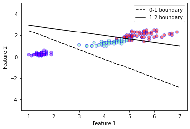
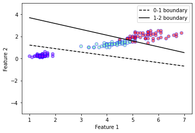
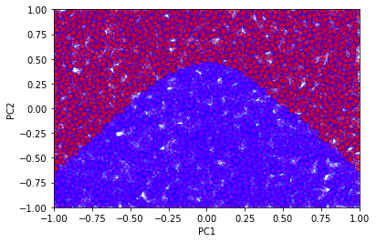
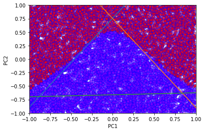

```python
from sklearn.datasets import load_breast_cancer, load_iris
from sklearn.discriminant_analysis import LinearDiscriminantAnalysis
from sklearn.decomposition import PCA
from sklearn.linear_model import LogisticRegression
import matplotlib.pyplot as plt
import numpy as np
from scipy.stats import multivariate_normal
from scipy.special import softmax
from scipy import sparse
from itertools import product
from tensorflow import keras
```

# Classification without Neural Networks

In this exercise, we shall compare a few non-neural network classifiers for the two class dataset available by calling **sklearn.datasets.load\_iris()**. This dataset has $K=3$ classes with $p=4$ features. For ease of visualisation, we shall use only the third and fourth numerical feature, i.e. $p=2$.


```python
data = load_iris()
X = data['data']
Y = data['target']
Nsamples = X.shape[0]
Nclass = len(set(Y))

X = X[:,[2,3]]
print(X.shape)

plt.xlabel('Feature 1')
plt.ylabel('Feature 2')
plt.scatter(
    X[:,0],
    X[:,1],
    c=Y,
    cmap='rainbow',
    alpha=0.5,
    edgecolors='b'
)
plt.show()
```

    (150, 2)


    

    


## LDA Classifier

In a previous exercise, we saw that linear discriminant analysis (LDA) can be used for dimensionality reduction. The procedure can actually also be extended to create a classifier. In LDA, we assume that the conditional probability density of each class $k$ is distributed according to a multivariate Gaussian

```{math}
f_k(\boldsymbol{x}) = \frac{1}{(2\pi)^{p/2}|W|^{1/2}}\exp{\left( -\frac{1}{2}(\boldsymbol{x}-\boldsymbol{\mu}_k)^T W^{-1}(\boldsymbol{x} -\boldsymbol{\mu}_k) \right)}
```

where $\boldsymbol{\mu}_k$ is mean of the class $k$ and $W$ is the covariance matrix (called the within-class scatter matrix from the previous exercise). Notice the implicit assumption that the density of each class is described by the same covariance matrix. Given the density, Bayes theorem tells us that the probability that a sample $\boldsymbol{x}$ is in class $k$ is given by

```{math}
\textrm{Pr}(G=k | \boldsymbol{x}) = \frac{f_k(\boldsymbol{x}) \pi_k}{\sum_{l=1}^{K} f_l(\boldsymbol{x})\pi_l}.
```

where $\pi_k$ are the priors. Usually the priors are simply set to be proportional to the number of samples in each class, i.e. $\pi_k = \frac{N_k}{\sum_{l=1}^{K} N_l}$ where $N_k$ is the number of samples in the class $k$. Given the priors, the covariance matrix can be defined as

```{math}
W = \sum_{k=1}^{K} \pi_k W_k
```

where $W_k$ is the covariance matrix of class $k$. The decision boundary between class $k$ and $l$ is then given by the condition

```{math}
\textrm{Pr}(G=k | \boldsymbol{x}) = \textrm{Pr}(G=l | \boldsymbol{x}).
```

The decision boundary can be obtained by equating the probabilities
```{math}
    \begin{split}
    \textrm{Pr}(G=k|\boldsymbol{x}) &= \textrm{Pr}(G=l|\boldsymbol{x}) \\
    f_{k}(\boldsymbol{x}) \pi_k &= f_{l}(\boldsymbol{x}) \pi_k \\
    \pi_k\exp{\left( -\frac{1}{2}(\boldsymbol{x}-\boldsymbol{\mu}_k)^T W^{-1}(\boldsymbol{x} -\boldsymbol{\mu}_k) \right)} &= \pi_l \exp{\left( -\frac{1}{2}(\boldsymbol{x}-\boldsymbol{\mu}_k)^T W^{-1}(\boldsymbol{x} -\boldsymbol{\mu}_l) \right)} \\
    \log(\frac{\pi_k}{\pi_l}) - \frac{1}{2} (\boldsymbol{\mu}_k + \boldsymbol{\mu}_l)^{T} W^{-1} (\boldsymbol{\mu}_k - \boldsymbol{\mu}_l) - \boldsymbol{x}^{T} W^{-1}(\boldsymbol{\mu}_k - \boldsymbol{\mu}_{l})&= 0 
    \end{split}
```
The last line gives the equation for the linear decision boundary. Notice that the term quadratic in $\boldsymbol{x}$ vanishes because the covariance matrix for the different classes are assumed to be equal, i.e. we have only 1 covariance matrix $W$ for all the classes. If we instead allow each class to have its own covariance matrix $W_k$, the problem is no longer linear, and we instead have a Quadratic Discriminant Analysis (QDA) which is also commonly used.

Now we shall implement the LDA classifier on our own using only the numpy and scipy libraries.


```python
class myLDA:
    """
    A simple implementation of the LDA classifier.
    """
    def __init__(self, X, Y):
        # Get information about the number of classes and samples
        self.G_ = list(set(Y))
        self.Nclass_ = len(self.G_)
        nsamp = X.shape[0]

        # Split the dataset in to individual classes
        X_split = [X[np.where(Y==k)[0]] for k in self.G_]
        N_split = [len(Xk) for Xk in X_split]

        # Compute the covariance of each class
        X_cov = [np.cov(Xk.T, bias=True) for Xk in X_split]

        # Compute the priors for each class
        self.priors_ = [Nk/nsamp for Nk in N_split]

        # Compute the class mean
        self.mu_ = [np.mean(Xk, axis=0) for Xk in X_split]

        # Compute the weighted covariance 
        self.W_ = np.sum(np.array([self.priors_[i]*X_cov[i] for i in range(self.Nclass_)]),axis=0)
    
    def pdf(self, x, k):
        """
        Defines the multivariate normal distribution
        """
        var = multivariate_normal(mean=self.mu_[self.G_.index(k)], cov=self.W_)
        return var.pdf(x)

    def predict_proba(self, x):
        """
        Probability distribution for over the possible classes given an input x.
        """
        unnormalised_probs = np.array([self.pdf(x,k) for k in range(self.Nclass_)]).transpose()
        return unnormalised_probs/np.sum(unnormalised_probs,axis=-1, keepdims=True)


    def plot_boundaries(self,k1,k2, ax, xmin=0, xmax=1, linestyle='-', color='k'):
        """
        Plot the decision boundary between class k1 and k2.
        """
        x1 = np.array([xmin,xmax])
        w1 = np.linalg.inv(self.W_).dot(self.mu_[k1]-self.mu_[k2])[0]
        w2 = np.linalg.inv(self.W_).dot(self.mu_[k1]-self.mu_[k2])[1]
        b = np.log(self.priors_[k1]/self.priors_[k2]) - 0.5 * (self.mu_[k1]+self.mu_[k2]).dot(np.linalg.inv(self.W_).dot(self.mu_[k1]-self.mu_[k2]))
        y1 = -(b+x1*w1)/w2 

        ax.plot(x1,y1,color=color, linestyle=linestyle,label="{0}-{1} boundary".format(k1, k2))


# Initialise our LDA object
mylda = myLDA(X,Y)

plt.xlabel('Feature 1')
plt.ylabel('Feature 2')
plt.ylim(-5,5)
plt.scatter(
    X[:,0],
    X[:,1],
    c=Y,
    cmap='rainbow',
    alpha=0.5,
    edgecolors='b'
)

# Plot decision boundaries
mylda.plot_boundaries(0,1, plt.gca(),xmin=1, xmax=7, linestyle = '--')
mylda.plot_boundaries(1,2, plt.gca(),xmin=1, xmax=7)

plt.legend()
plt.show()
```


    

    


```python
# LDA using sklearn
lda = LinearDiscriminantAnalysis(solver='eigen')
lda.fit(X,Y)
predictions = lda.predict(X)
acc = len(np.where(Y == predictions)[0])/Nsamples
print("LDA Accuracy =", acc)

# Compare the sklearn 
print("sklearn LDA prediction probabilities =\n", lda.predict_proba(X[48:51]))
print("my LDA prediction probabilities =\n", mylda.predict_proba(X[48:51]))
```

    LDA Accuracy = 0.96
    sklearn LDA prediction probabilities =
     [[1.00000000e+00 1.76702478e-11 7.43223369e-26]
     [1.00000000e+00 5.20426764e-12 1.44284377e-26]
     [3.43354884e-14 9.87797694e-01 1.22023062e-02]]
    my LDA prediction probabilities =
     [[1.00000000e+00 1.76702478e-11 7.43223369e-26]
     [1.00000000e+00 5.20426764e-12 1.44284377e-26]
     [3.43354884e-14 9.87797694e-01 1.22023062e-02]]


## Logistic Regression

In the lecture, we already discussed the logistic regression procedure. For multiple classes ($K>2$), we can define the logistic regression model as

```{math}
\begin{split}
f_k(\boldsymbol{x}) &= \alpha_{k} + \sum_{j}\beta_{kj}x_j \\
\textrm{Pr}(G=k | \boldsymbol{x}) &= \sigma(\boldsymbol{f}(\boldsymbol{x}))_k
\end{split}
```

where 

```{math}
\sigma(\boldsymbol{f})_k =\frac{e^{f_k}}{\sum_{j} e^{f_j}}
```

is the softmax function. $\boldsymbol{\alpha}$ is a $K \times 1$ vector and $\boldsymbol{\beta}$ is a $K \times p$ matrix. Notice that this model is similar to a "neural network", without any hidden units, with just a single softmax output layer. The model can then be trained by performing gradient descent on the cross entropy defined by

```{math}
L(\boldsymbol{x} | \boldsymbol{\alpha}, \boldsymbol{\beta}) = -\sum_{k} y_k \log (\textrm{Pr}(G=k | \boldsymbol{x}))
```

where $y_i = 1$ if the true classification of the sample $\boldsymbol{x}$ is $i$, otherwise $y_i = 0$. Noting the close similarity of this loss function with the Kullback–Leibler divergence 

```{math}
D(p || q) = \sum_{x} P(x) \log(\frac{P(x)}{Q(x)}),
```


let us first prove that the KL divergence is non-negative. From basic analysis, we know that $\log(x) \leq x - 1$ for all $x$.
Using this fact, we can then see that

```{math}
\begin{split}
D(p||q) &= \sum_{x} P(x)\log(\frac{P(x)}{Q(x)}) \\
&= -\sum_{x} P(x)\log(\frac{Q(x)}{P(x)}) \\
&\geq \sum_{x} P(x)(\frac{Q(x)}{P(x)} - 1)\\
&= \sum_{x} Q(x) - P(x) \\
&= 0
\end{split}
```

where in the last line we used the fact that the probability distributions $P(x)$ and $Q(x)$ are normalised. Going back to the logisitic regression problem, we see that we first need to obtain the derivatives of the loss function w.r.t. the parameters of the model $\alpha$ and $\beta$.

The derivative of the softmax function is given by

```{math}
\frac{\partial \sigma_{j}}{\partial f_k} = \sigma_j (\delta_{jk} - \sigma_k).
```

In addition we have the derivatives

```{math}
\frac{\partial f_{j}}{\partial \alpha_k} = \delta_{jk}, \ \ \ \frac{\partial f_{j}}{\partial \beta_{kl}} = \delta_{jk} x_{l}
```

Then, the derivative of the loss on a sample $(\boldsymbol{x}, \boldsymbol{y})$ is given by

```{math}
\begin{split}
\frac{\partial L}{\partial \beta_{jk}} &= \sum_{l} y_{l} \frac{\partial}{\partial \beta_{jk}} \log(\textrm{Pr}(G=k|\boldsymbol{x})) \\
&= \sum_{l} y_l \frac{{\partial \sigma_l}/{\partial \beta_{jk}}}{\sigma_{l}} \\
&= \sum_{l} y_l \frac{\sum_{m}\frac{\partial \sigma_l}{\partial f_m} \frac{\partial f_m}{\partial \beta_{jk}}} {\sigma_{l}} \\
&= \sum_{l} y_l \frac{\sum_{m} \sigma_{l}(\delta_{lm} - \sigma_m) \cdot (\delta_{mj}x_k)} {\sigma_{l}} \\
&= (y_j - \sigma_j)x_k
\end{split} 
```

Similarly,

```{math}
\frac{\partial L}{\partial \alpha_j} = (y_j - \sigma_j)
```

By averaging the derivative across the dataset, we can then implement the gradient descent method to solve our optimisation problem.


```python
class myLR:
    """
    A simple implementation of the LR classifier using gradient descent.
    """
    def __init__(self, X, Y):
        self.G_ = set(Y)
        self.Nclass_ = len(self.G_)
        nsamp = X.shape[0]
        self.Nfeatures_ = X.shape[1]
        self.X_ = X[:]
        data = np.ones(nsamp)
        row = list(range(nsamp))
        col = Y
        self.Y_ = sparse.csr_matrix((data, (row, col)), shape=(nsamp, 3)).todense()

        # Randomly initialise the parameters
        # Notice that we have a nclass by (nfeatures+1) matrix
        # because we have combined the alpha weights as an additional column 
        self.beta_ = np.random.normal(size=(self.Nclass_, self.Nfeatures_+1))
    
    def run(self, lr, niter):
        """
        Perform gradient descent with learning rate lr for niter itertations.
        """
        # We concatenate an additional column of ones in our data matrix for convenience
        nsamp = self.X_.shape[0]
        Xp = np.concatenate((np.ones((nsamp,1)),self.X_),axis=1)

        for i in range(niter):
            probs = self.predict_proba(self.X_)
            grads = np.einsum("nk,nj->kj", self.Y_ - probs, Xp)
            self.beta_ += lr*grads

    def predict_proba(self, X):
        """
        Probability distribution for over the possible classes given an input x.
        """
        Xp = np.concatenate((np.ones((X.shape[0],1)),X),axis=1)
        f = Xp.dot(self.beta_.transpose())
        return softmax(f, axis = 1)

    def predict(self, X):
        """
        Gives the most likely class.
        """
        preds = np.argmax(self.predict_proba(X), axis=1)
        return preds

    def plot_boundaries(self, k1, k2, ax, xmin=0, xmax=1, linestyle='-', color='k'):
        """
        Plot decision boundary between class k1 and k2.
        """
        alpha = self.beta_[:,0]
        beta = self.beta_[:,1:]
        x1 = np.array([xmin, xmax])
        w1 = (beta[k1] - beta[k2])[0]
        w2 = (beta[k1] - beta[k2])[1]
        b = alpha[k1] - alpha[k2]
        y1 = -(b+x1*w1)/w2 
        ax.plot(x1,y1,color=color, linestyle=linestyle,label="{0}-{1} boundary".format(k1, k2))

# Perform logistic regression using our own implementation
mylr = myLR(X,Y)
mylr.run(0.01,10000)
predictions = mylr.predict(X)
acc = len(np.where(Y == predictions)[0])/Nsamples
print("myLR Accuracy =", acc)
```

    myLR Accuracy = 0.96


```python
# Comparing with the sklearn implementation
clf = LogisticRegression(random_state=0, penalty='none').fit(X, Y)
predictions = clf.predict(X)
acc = len(np.where(Y == predictions)[0])/Nsamples
print("LR Accuracy =", acc)

```

    LR Accuracy = 0.96


```python
# Plot decision boundaries
mylr.plot_boundaries(0,1, plt.gca(),xmin=1, xmax=7, linestyle = '--')
mylr.plot_boundaries(1,2, plt.gca(),xmin=1, xmax=7)

plt.ylim(-5,5)
plt.xlabel('Feature 1')
plt.ylabel('Feature 2')
plt.ylim(-5,5)
plt.scatter(
    X[:,0],
    X[:,1],
    c=Y,
    cmap='rainbow',
    alpha=0.5,
    edgecolors='b'
)
plt.legend()
plt.show()
```


    

    


# Dense Neural Networks

In this exercise, we shall train a simple dense neural network classifier for the MNIST handwritten digits dataset available within tensorflow. The dataset consist of images of handwritten digits with 28 by 28 pixels.

## Loading the MNIST dataset


```python
# Load Dataset 
(x_train , y_train), (x_test , y_test) = keras.datasets.mnist.load_data()

# Standardise the data to have a spread of 1
x_train, x_test = x_train / 255.0, x_test / 255.0

plt.imshow(x_train[0])
```


   


    

    


## Define the network


```python
# Define the model
model = keras.Sequential([
    keras.layers.Flatten(input_shape=(28,28)),
    keras.layers.Dense(12, activation='relu'),
    keras.layers.Dense(10, activation='softmax')
])
```

The softmax activation in the final layer ensures that the output can be treated as a probability distribution over the 10 possible classes, i.e. the model defines the function 

```{math}
\boldsymbol{f}: \mathbb{R}^{28 \times 28} \rightarrow \mathbb{R}^{10}
```

where the output $\boldsymbol{f}(\boldsymbol{x})$ satisfies

```{math}
\begin{split}
& f_{i}(\boldsymbol{x}) \geq 0 \ \ \textrm{for}\ \  i = 0, 1, \dots, 9 \\
& \sum_{i=0}^{9}  f_{i}(\boldsymbol{x}) = 1.
\end{split}
```


```python
# Lets look at the model's prediction before training it
pred = model(x_train[0:1])
print(pred.numpy())
plt.plot(pred[0])
plt.xlabel('Classification')
plt.ylabel('Probability')
plt.show()
```

    [[0.0934115  0.1345084  0.06015386 0.17981586 0.16215855 0.09857295
      0.10626732 0.06349586 0.05087668 0.05073911]]


    

    


## Choosing an optimizer and a loss function

We chose the ADAM optimizer (Don't worry about the details of the optimizer, you will learn about them in the next task. For now, it is enough to know that this is similar to stochastic gradient descent.). The loss function here is known as the cross entropy defined as 

```{math}
L = -\sum_{i=0}^{9} y_i \log(f_i(\boldsymbol{x}))
```

where $y_i = 1$ if the true classification of the sample $\boldsymbol{x}$ is $i$, otherwise $y_i = 0$. The function $f_i(\boldsymbol{x})$ is the probability distribution defined above. 


```python
# Compile and train the model
model.compile(optimizer='adam',
              loss=keras.losses.SparseCategoricalCrossentropy(),
              metrics=['accuracy'])
history = model.fit(x_train, y_train, validation_data=(x_test, y_test), epochs=10, batch_size=32)
```

    Epoch 1/10
    1875/1875 [==============================] - 1s 751us/step - loss: 0.5062 - accuracy: 0.8557 - val_loss: 0.2964 - val_accuracy: 0.9141
    Epoch 2/10
    1875/1875 [==============================] - 1s 689us/step - loss: 0.2816 - accuracy: 0.9193 - val_loss: 0.2613 - val_accuracy: 0.9223
    Epoch 3/10
    1875/1875 [==============================] - 1s 618us/step - loss: 0.2522 - accuracy: 0.9267 - val_loss: 0.2421 - val_accuracy: 0.9299
    Epoch 4/10
    1875/1875 [==============================] - 1s 624us/step - loss: 0.2357 - accuracy: 0.9324 - val_loss: 0.2241 - val_accuracy: 0.9336
    Epoch 5/10
    1875/1875 [==============================] - 1s 628us/step - loss: 0.2237 - accuracy: 0.9356 - val_loss: 0.2210 - val_accuracy: 0.9345
    Epoch 6/10
    1875/1875 [==============================] - 1s 606us/step - loss: 0.2143 - accuracy: 0.9381 - val_loss: 0.2221 - val_accuracy: 0.9345
    Epoch 7/10
    1875/1875 [==============================] - 1s 628us/step - loss: 0.2071 - accuracy: 0.9404 - val_loss: 0.2110 - val_accuracy: 0.9384
    Epoch 8/10
    1875/1875 [==============================] - 1s 614us/step - loss: 0.2009 - accuracy: 0.9419 - val_loss: 0.2109 - val_accuracy: 0.9376
    Epoch 9/10
    1875/1875 [==============================] - 1s 616us/step - loss: 0.1946 - accuracy: 0.9441 - val_loss: 0.2110 - val_accuracy: 0.9379
    Epoch 10/10
    1875/1875 [==============================] - 1s 611us/step - loss: 0.1894 - accuracy: 0.9455 - val_loss: 0.2092 - val_accuracy: 0.9386


```python
# The model's predicition after training now makes sense!
pred = model(x_train[0:1])
print(pred.numpy())
plt.plot(pred[0])
plt.xlabel('Classification')
plt.ylabel('Probability')
plt.show()
```

    [[4.9257022e-05 2.3301787e-05 3.0720589e-04 3.1944558e-01 3.5377405e-09
      6.7966461e-01 7.4789693e-07 4.9926934e-04 1.5144547e-06 8.4192516e-06]]


    

    


```python
# We can also look at the optimisation history
plt.plot(history.history['accuracy'], label='Training Accuracy')
plt.xlabel('Epoch')
plt.ylabel('Accuracy')
plt.legend()
plt.show()
```


    

    


## Comparing Neural Networks with Logistic Regression

If one looks closely at the functional form of the LR model and compares it with a simple dense neural network, one would notice that the LR model is simply a "neural network" without hidden layers. To investigate this, we consider a fictitious 2-dimensional dataset with 2 classes constructed as follows. The data points $\boldsymbol{x} \in \mathbb{R}^2$ are uniformly sampled within a square such that $-1\leq x_0 \leq 1$  and $-1\leq x_1 \leq 1$. The data point belongs to the class $1$ if 

```{math}
x_1 \leq 0.5 \sin(2\pi x_0) 
```

otherwise, it belongs to class $2$. The dataset can be created with the code snippet below: 


```python
# Construct the dataset
sX = np.random.uniform(low=-1, high=1, size=(10000,2))
sY = np.array([0 if s[1]<=0.5*np.cos(np.pi*s[0]) else 1 for s in sX])
plt.xlabel('Feature 1')
plt.ylabel('Feature 2')
plt.ylim(-5,5)
plt.scatter(
    sX[:,0],
    sX[:,1],
    c=sY,
    cmap='rainbow',
    alpha=0.5,
    edgecolors='b'
)
plt.xlim(-1,1)
plt.ylim(-1,1)
plt.show()
```


    

    


```python
# Use sklearn's Logistic regression method
clf = LogisticRegression(random_state=0).fit(sX, sY)
predictions = clf.predict(sX)
acc = len(np.where(sY == predictions)[0])/10000
print("LR Accuracy =", acc)
plt.xlabel('PC1')
plt.ylabel('PC2')
plt.ylim(-5,5)
plt.scatter(
    sX[:,0],
    sX[:,1],
    c=predictions,
    cmap='rainbow',
    alpha=0.5,
    edgecolors='b'
)
plt.xlim(-1,1)
plt.ylim(-1,1)
plt.show()
```

    LR Accuracy = 0.8439


    

    


We see very clearly the linear decision boundary of the logistic regression method. This is clearly not sufficient to correctly classify this fictitious data. We now proceed to a simple neural network solution.


```python
def single_layer_model(h):
    model = keras.Sequential([
    keras.layers.Dense(h, activation='tanh'),
    keras.layers.Dense(2, activation='softmax')
    ])
    model.compile(optimizer='adam', loss=keras.losses.SparseCategoricalCrossentropy(),metrics=['accuracy'])
    return model

# A simple neural network with 2 hidden units
model = single_layer_model(2)
model.fit(sX,sY,epochs=50,batch_size=32)
```

    Epoch 1/50
    313/313 [==============================] - 0s 880us/step - loss: 0.4734 - accuracy: 0.8328
    Epoch 2/50
    313/313 [==============================] - 0s 618us/step - loss: 0.3799 - accuracy: 0.8492
    Epoch 3/50
    313/313 [==============================] - 0s 428us/step - loss: 0.3376 - accuracy: 0.8499
    Epoch 4/50
    313/313 [==============================] - 0s 430us/step - loss: 0.3190 - accuracy: 0.8517
    Epoch 5/50
    313/313 [==============================] - 0s 429us/step - loss: 0.3082 - accuracy: 0.8543
    Epoch 6/50
    313/313 [==============================] - 0s 437us/step - loss: 0.2987 - accuracy: 0.8592
    Epoch 7/50
    313/313 [==============================] - 0s 427us/step - loss: 0.2874 - accuracy: 0.8652
    Epoch 8/50
    313/313 [==============================] - 0s 428us/step - loss: 0.2743 - accuracy: 0.8720
    Epoch 9/50
    313/313 [==============================] - 0s 425us/step - loss: 0.2596 - accuracy: 0.8804
    Epoch 10/50
    313/313 [==============================] - 0s 436us/step - loss: 0.2439 - accuracy: 0.8910
    Epoch 11/50
    313/313 [==============================] - 0s 433us/step - loss: 0.2279 - accuracy: 0.9028
    Epoch 12/50
    313/313 [==============================] - 0s 429us/step - loss: 0.2122 - accuracy: 0.9130
    Epoch 13/50
    313/313 [==============================] - 0s 436us/step - loss: 0.1969 - accuracy: 0.9243
    Epoch 14/50
    313/313 [==============================] - 0s 426us/step - loss: 0.1830 - accuracy: 0.9329
    Epoch 15/50
    313/313 [==============================] - 0s 428us/step - loss: 0.1700 - accuracy: 0.9404
    Epoch 16/50
    313/313 [==============================] - 0s 427us/step - loss: 0.1581 - accuracy: 0.9482
    Epoch 17/50
    313/313 [==============================] - 0s 428us/step - loss: 0.1472 - accuracy: 0.9539
    Epoch 18/50
    313/313 [==============================] - 0s 430us/step - loss: 0.1376 - accuracy: 0.9569
    Epoch 19/50
    313/313 [==============================] - 0s 426us/step - loss: 0.1290 - accuracy: 0.9614
    Epoch 20/50
    313/313 [==============================] - 0s 427us/step - loss: 0.1212 - accuracy: 0.9631
    Epoch 21/50
    313/313 [==============================] - 0s 432us/step - loss: 0.1144 - accuracy: 0.9661
    Epoch 22/50
    313/313 [==============================] - 0s 437us/step - loss: 0.1083 - accuracy: 0.9689
    Epoch 23/50
    313/313 [==============================] - 0s 426us/step - loss: 0.1029 - accuracy: 0.9702
    Epoch 24/50
    313/313 [==============================] - 0s 430us/step - loss: 0.0982 - accuracy: 0.9722
    Epoch 25/50
    313/313 [==============================] - 0s 427us/step - loss: 0.0938 - accuracy: 0.9718
    Epoch 26/50
    313/313 [==============================] - 0s 448us/step - loss: 0.0899 - accuracy: 0.9734
    Epoch 27/50
    313/313 [==============================] - 0s 426us/step - loss: 0.0865 - accuracy: 0.9741
    Epoch 28/50
    313/313 [==============================] - 0s 434us/step - loss: 0.0834 - accuracy: 0.9741
    Epoch 29/50
    313/313 [==============================] - 0s 427us/step - loss: 0.0806 - accuracy: 0.9750
    Epoch 30/50
    313/313 [==============================] - 0s 428us/step - loss: 0.0781 - accuracy: 0.9756
    Epoch 31/50
    313/313 [==============================] - 0s 426us/step - loss: 0.0757 - accuracy: 0.9763
    Epoch 32/50
    313/313 [==============================] - 0s 430us/step - loss: 0.0735 - accuracy: 0.9759
    Epoch 33/50
    313/313 [==============================] - 0s 429us/step - loss: 0.0716 - accuracy: 0.9771
    Epoch 34/50
    313/313 [==============================] - 0s 427us/step - loss: 0.0698 - accuracy: 0.9776
    Epoch 35/50
    313/313 [==============================] - 0s 430us/step - loss: 0.0682 - accuracy: 0.9780
    Epoch 36/50
    313/313 [==============================] - 0s 433us/step - loss: 0.0667 - accuracy: 0.9784
    Epoch 37/50
    313/313 [==============================] - 0s 428us/step - loss: 0.0653 - accuracy: 0.9787
    Epoch 38/50
    313/313 [==============================] - 0s 431us/step - loss: 0.0640 - accuracy: 0.9787
    Epoch 39/50
    313/313 [==============================] - 0s 437us/step - loss: 0.0627 - accuracy: 0.9793
    Epoch 40/50
    313/313 [==============================] - 0s 430us/step - loss: 0.0616 - accuracy: 0.9792
    Epoch 41/50
    313/313 [==============================] - 0s 427us/step - loss: 0.0604 - accuracy: 0.9793
    Epoch 42/50
    313/313 [==============================] - 0s 439us/step - loss: 0.0594 - accuracy: 0.9797
    Epoch 43/50
    313/313 [==============================] - 0s 435us/step - loss: 0.0585 - accuracy: 0.9795
    Epoch 44/50
    313/313 [==============================] - 0s 431us/step - loss: 0.0576 - accuracy: 0.9802
    Epoch 45/50
    313/313 [==============================] - 0s 430us/step - loss: 0.0568 - accuracy: 0.9802
    Epoch 46/50
    313/313 [==============================] - 0s 430us/step - loss: 0.0559 - accuracy: 0.9797
    Epoch 47/50
    313/313 [==============================] - 0s 539us/step - loss: 0.0552 - accuracy: 0.9802
    Epoch 48/50
    313/313 [==============================] - 0s 433us/step - loss: 0.0545 - accuracy: 0.9805
    Epoch 49/50
    313/313 [==============================] - 0s 427us/step - loss: 0.0538 - accuracy: 0.9807
    Epoch 50/50
    313/313 [==============================] - 0s 427us/step - loss: 0.0531 - accuracy: 0.9814


   


Since the network is non-linear, it is not straightforward to derive an explicit formula for the boundary, but we can simply evaluate the network on a grid and plot the result.

The functional form of this neural network is given by

```{math}
\boldsymbol{f}(\boldsymbol{x}) =  \sigma(W^{(2)} \tanh(W^{(1)}\boldsymbol{x} + \boldsymbol{b}^{(1)})+\boldsymbol{b}^{(2)})
```

where $W^{(i)}$ and $\boldsymbol{b}^{(i)}$ are the weights and biases of layer $i$. 


```python
# Use our trained neural network to predict the classes
prediction = model.predict_classes(sX)
plt.xlabel('PC1')
plt.ylabel('PC2')
plt.scatter(
    sX[:,0],
    sX[:,1],
    c=prediction,
    cmap='rainbow',
    alpha=0.5,
    edgecolors='b'
)
plt.xlim(-1,1)
plt.ylim(-1,1)
plt.show()
```


    

    


Varying the number of hidden units allows us to observe how the decision boundary changes. 


```python
# With more hidden units the accuracy increases
h = 3
model = single_layer_model(h)
hist = model.fit(sX,sY,epochs=50,batch_size=32, verbose=0)

# We can extract the weights and biases from the network 
# to plot the corresponding lines
first_layer_weights = model.layers[0].get_weights()[0]
first_layer_biases = model.layers[0].get_weights()[1]
x = np.zeros((h,2))
y = np.zeros((h,2))
for i in range(h):
    x[i,:]=np.array([-1,1])
    y[i,:]=np.array([(first_layer_weights[0,i]-first_layer_biases[i])/first_layer_weights[1,i], -(first_layer_weights[0,i]+first_layer_biases[i])/first_layer_weights[1,i]])

for i in range(h):
    plt.plot(x[i], y[i])

# Plot also the networks predictions
prediction = model.predict_classes(sX)
plt.xlabel('PC1')
plt.ylabel('PC2')
plt.scatter(
    sX[:,0],
    sX[:,1],
    c=prediction,
    cmap='rainbow',
    alpha=0.5,
    edgecolors='b'
)
plt.xlim(-1,1)
plt.ylim(-1,1)
plt.show()

```


    

    


The weights and biases from the model can be used to plot the lines defined by

```{math}
W^{(1)}_{i1} x  + W^{(1)}_{i2}  y  + b^{(1)}_{i} = 0
```

for each index $i$ (for $m$ hidden layers, $i = 1, \dots , m$). Notice that the lines somewhat mimic the decision boundary of the network.
