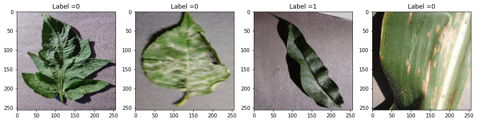
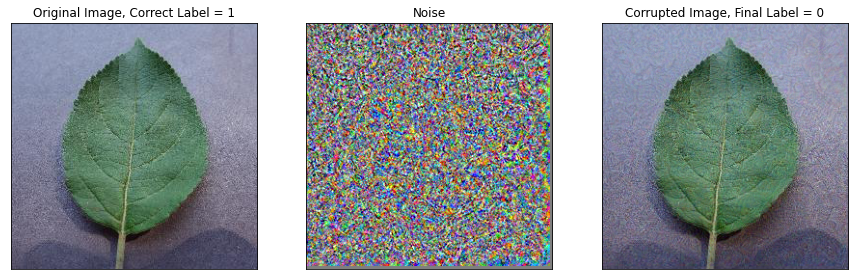
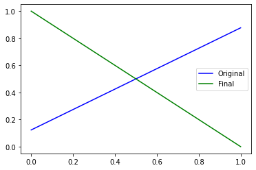
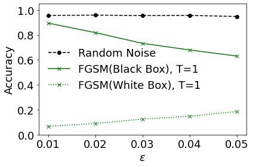

# Exercise: Transfer Learning and Adversarial Attacks

To run the script you can download the data from the [original source](https://data.mendeley.com/datasets/tywbtsjrjv/1). The models used in this notebook will take some time to run so it is best to run it on google colab with a GPU.


```python
# Tensorflow and keras
import tensorflow as tf
from tensorflow import keras

# To use GPU/TPU, go to Edit -> Notebook Settings -> select GPU
# GPU
device_name = tf.test.gpu_device_name()
if device_name != '/device:GPU:0':
  raise SystemError('GPU device not found')
print('Found GPU at: {}'.format(device_name))

print(tf.__version__)
```


```python
# Helper Libraries
import numpy as np
import matplotlib.pyplot as plt
import scipy
import os

from tensorflow.keras.preprocessing.image import load_img, img_to_array
# Mount Drive
# Directory: drive/My Drive/Colab Notebooks/train.csv
from google.colab import drive
drive.mount('/content/drive')

# Directory
directory = "your google drive directory"
inceptionv3_chkp = "inceptionv3.h5"
mobilenetv2_chkp = "mobilenet_v2.h5"
simpleconv_chkp = "simple_conv_model.h5"
```


## Transfer Learning

In this exercise, we shall use a pre-trained model to perform transfer learning. A pre-trained model is a model that has been been pre-trained on a large dataset, typically for image classification. The motivation behind transfer learning is then as follows: A deep neural network performs a series of intermediate transformations, before performing the final classification. These intermediate transformations can then be considered as ”learnt” feature maps. If the model was trained on a large and generic enough dataset, the hope is that these intermediate feature maps would have picked relevant features required for the task. The idea behind transfer learning is then that these ”learnt” feature maps would also be useful for our more specific task, assuming our dataset and our task is closely related to that of the pretrained model.
For this exercise, we shall be using a dataset containing labelled images of leaves, and the task is to decide if the leaf is healthy or unhealthy. These images are 256 x 256 RGB pixel and so they can take quite a lot of memory. Let’s load and prepare the dataset.


```python
# Load Images
images = np.load(directory+'images.npy')
labels = np.load(directory+'labels.npy')

Number_of_samples = images.shape[0]
IMG_SHAPE = images.shape[1:]

# Shuffle images
np.random.seed(0)
idx = np.random.permutation(Number_of_samples)
images = images[idx]
labels = labels[idx]


# images = tf.keras.applications.inception_v3.preprocess_input(images)
images = images.astype(np.float32) / 255
labels = labels.astype(np.int)
```

Next, its important to get a feeling of how our data looks like, so lets plot a few samples.


```python
# Check
fig, ax = plt.subplots(1,4, figsize=(16,5))
for i in range(4):
  ax[i].set_title("Label ="+str(labels[i]))
  ax[i].imshow((images[i]))
plt.show()
```


    

    


Now, we split the dataset into training, validation and testing.


```python
# Split Data sets
cut1 = int(Number_of_samples * 0.7)
cut2 = int(Number_of_samples * 0.85) 


x_train = images[:cut1]
y_train = labels[:cut1]

x_val = images[cut1:cut2]
y_val = labels[cut1:cut2]

x_test = images[cut2:]
y_test = labels[cut2:]

print("Dataset sizes =", x_train.shape[0], x_val.shape[0], x_test.shape[0])
print("Image Shape =", IMG_SHAPE)
```

    Dataset sizes = 3789 812 812
    Image Shape = (256, 256, 3)


### Load the pretrained model


```python
base_mn_model = tf.keras.applications.MobileNetV2(input_shape=IMG_SHAPE,
                                                 include_top=False,
                                                 weights='imagenet')
base_mn_model.trainable = False

test_output = base_mn_model(x_train[0:1]).numpy()
```


    Downloading data from https://storage.googleapis.com/tensorflow/keras-applications/mobilenet_v2/mobilenet_v2_weights_tf_dim_ordering_tf_kernels_1.0_224_no_top.h5
    9412608/9406464 [==============================] - 0s 0us/step


```python
print(test_output.shape)
```

    (1, 8, 8, 1280)


Notice that the output is extremely large. This actually corresponds to features learnt by the pretrained model. To use it for our binary classification task we should add an additional layer on top of it.

### Add a classification layer


```python
# Base Model
try:
  mn_model = keras.models.load_model(directory+mobilenetv2_chkp)
  print("mobilenet model loaded")
except:
  base_mn_model = tf.keras.applications.MobileNetV2(input_shape=(224,224,3),
                                                  include_top=False,
                                                  weights='imagenet')
  base_mn_model.trainable = False

  # Full Model
  mn_model = tf.keras.Sequential([
    keras.layers.experimental.preprocessing.Resizing(
      224, 224, interpolation='bilinear'),                               
    base_mn_model,
    tf.keras.layers.GlobalAveragePooling2D(),
    tf.keras.layers.Dense(2,activation='softmax')
  ])

  # Compile and train the full model
  base_learning_rate = 0.0001
  mn_model.compile(optimizer=tf.keras.optimizers.RMSprop(lr=base_learning_rate),
                loss="sparse_categorical_crossentropy",
                metrics=['accuracy'])
  mn_model.fit(x_train,y_train, batch_size=32, epochs=30,validation_data=(x_val,y_val))
  mn_model.save(directory+mobilenetv2_chkp)
```

    mobilenet model loaded


We have added a average pooling layer followed by a softmax dense layer with 2 outputs corresponding to our classification problem (healthy vs not healthy). As a check lets now compute both the test and validation accuracy:


```python
logits = mn_model.predict(x_train)
predictions = np.argmax(logits,axis=1)
num_correct = np.where((predictions == y_train)==True)[0].shape[0]
print('MobileNet Model Training Accuracy =', num_correct/y_train.shape[0])

logits = mn_model.predict(x_val)
predictions = np.argmax(logits,axis=1)
num_correct = np.where((predictions == y_val)==True)[0].shape[0]
print('MobileNet Model Validation Accuracy =', num_correct/y_val.shape[0])

logits = mn_model.predict(x_test)
predictions = np.argmax(logits,axis=1)
num_correct = np.where((predictions == y_test)==True)[0].shape[0]
print('MobileNet Model Test Accuracy =', num_correct/y_val.shape[0])
```

    MobileNet Model Training Accuracy = 0.9804697809448403
    MobileNet Model Validation Accuracy = 0.9692118226600985
    MobileNet Model Test Accuracy = 0.9692118226600985


Its purely conincidence that the accuracies are exactly the same. Let's compare this performance with a simple convolutional network.


```python
# Simple Convolutional Model
try:
  conv_model = keras.models.load_model(directory+simpleconv_chkp)
  print("simple model loaded")
except:
  conv_model = keras.Sequential([
      keras.layers.Conv2D(filters = 32, kernel_size = (5,5),padding = 'Same', 
                  activation ='relu', input_shape = (256,256,3)),
      keras.layers.Conv2D(filters = 16, kernel_size = (3,3),padding = 'Same', 
                  activation ='relu'),
      keras.layers.Conv2D(filters = 8, kernel_size = (3,3),padding = 'Same', 
                  activation ='relu'),
      keras.layers.Flatten(),
      tf.keras.layers.Dense(2,activation='softmax')
      ])

  base_learning_rate = 0.0001  
  conv_model.compile(optimizer=tf.keras.optimizers.RMSprop(lr=base_learning_rate), 
                    loss="sparse_categorical_crossentropy",
                    metrics=['accuracy'])

  conv_model.fit(x_train,y_train, batch_size=32, epochs=30,validation_data=(x_val,y_val))
  conv_model.save(directory+simpleconv_chkp)
```

    simple model loaded


```python
logits = conv_model.predict(x_train)
predictions = np.argmax(logits,axis=1)
num_correct = np.where((predictions == y_train)==True)[0].shape[0]
print('Simple Conv Model Training Accuracy =', num_correct/y_train.shape[0])

logits = conv_model.predict(x_val)
predictions = np.argmax(logits,axis=1)
num_correct = np.where((predictions == y_val)==True)[0].shape[0]
print('Simple Conv Model Validation Accuracy =', num_correct/y_val.shape[0])

logits = conv_model.predict(x_test)
predictions = np.argmax(logits,axis=1)
num_correct = np.where((predictions == y_test)==True)[0].shape[0]
print('Simple Conv Model Test Accuracy =', num_correct/y_val.shape[0])
```

    Simple Conv Model Training Accuracy = 1.0
    Simple Conv Model Validation Accuracy = 0.8682266009852216
    Simple Conv Model Test Accuracy = 0.8990147783251231


The performance is indeed much poorer and there is definitely a high degree of overfitting. Of course this is just a simple architecture and with some fine tuning and regularisation, it is definitely possible to obtain better performance. But the main point is that, it was extremely easy to obtain good results when using a suitable pretrained model.

## Adversarial Attacks

In this exercise, we want to generate adversarial examples for another pretrained model, inceptionv3.


```python
# Target Model
try:
  model = keras.models.load_model(directory+inceptionv3_chkp)
  print("inception model loaded")
except:
  base_model = tf.keras.applications.InceptionV3(input_shape=IMG_SHAPE,
                                                include_top=False,
                                                weights='imagenet')
  base_model.trainable = False

  # Full Model
  model = tf.keras.Sequential([
    base_model,
    tf.keras.layers.GlobalAveragePooling2D(),
    tf.keras.layers.Dense(2,activation='softmax')
  ])

  base_learning_rate = 0.0001
  model.compile(optimizer=tf.keras.optimizers.RMSprop(lr=base_learning_rate),
                loss="sparse_categorical_crossentropy",
                metrics=['accuracy'])
  model.fit(x_train,y_train, batch_size=32, epochs=30,validation_data=(x_val,y_val))
  model.save(directory+inceptionv3_chkp)
```

    inception model loaded


Let's also check the training/val/test accuracies of this target model.


```python
logits = model.predict(x_train)
predictions = np.argmax(logits,axis=1)
num_correct = np.where((predictions == y_train)==True)[0].shape[0]
print('Target Model Training Accuracy =', num_correct/y_train.shape[0])

logits = model.predict(x_val)
predictions = np.argmax(logits,axis=1)
num_correct = np.where((predictions == y_val)==True)[0].shape[0]
print('Target Model Validation Accuracy =', num_correct/y_val.shape[0])

logits = model.predict(x_test)
predictions = np.argmax(logits,axis=1)
num_correct = np.where((predictions == y_test)==True)[0].shape[0]
print('Target Model Test Accuracy =', num_correct/y_val.shape[0])
```

    Target Model Training Accuracy = 0.9609395618896807
    Target Model Validation Accuracy = 0.9408866995073891
    Target Model Test Accuracy = 0.9532019704433498


### White box attack

If one has easy access to this target model, a simple approach to generating adversarial images can be achieved using the fast gradient sign method (FGSM) explained in [](sec:interpretability). Using tensorflow GradientTape, which you encountered in the exercise on variational autoencoders, we implement the FGSM below to generate adversarial images for this target model. Let's implement a simple function to do this.


```python
def fgsm(target_model, img, target_label, epsilon = 0.1,steps = 2):
    output_img = np.copy(img).astype(np.float32)
    output_img = tf.convert_to_tensor(img)

    alpha = epsilon/steps

    noise = np.zeros(output_img.shape,dtype=np.float32)
    noise = tf.convert_to_tensor(noise)
    
    if isinstance(target_label, np.uint8):
      target_vector = np.zeros((1,2))
      target_vector[0,target_label] = 1
    else:
      target_vector = np.copy(target_label)

    for n in tf.range(steps):
      loss = tf.constant(0.0)
      with tf.GradientTape() as tape:
        tape.watch(output_img)
        pred = target_model(output_img)
        loss = tf.reduce_sum(tf.math.square(pred-target_vector))
      grads = tape.gradient(loss, output_img)

      output_img = output_img + tf.math.sign(grads)*alpha
      noise = noise + tf.math.sign(grads)/steps
      output_img = tf.clip_by_value(output_img, 0, 1, name=None)

    return noise, output_img
```


```python
choice = 3
img = x_test[choice:choice+1]

noise, final_img = fgsm(model, img, y_test[choice].astype(np.uint8),epsilon=0.05,steps=5)

initial_pred = model(img).numpy()
final_pred = model(final_img).numpy()


fig, ax = plt.subplots(1,3, figsize=(15,5))
for i in range(3):
  ax[i].set_xticks([])
  ax[i].set_yticks([])
ax[0].imshow(img[0])
ax[0].set_title('Original Image, Correct Label = '+ str(y_test[choice]))
ax[1].imshow(noise[0]*0.5 + 0.5)
ax[1].set_title("Noise")
ax[2].imshow(final_img[0])
ax[2].set_title('Corrupted Image, Final Label = '+ str(np.argmax(final_pred)))
plt.show()

plt.plot(initial_pred[0],'b-', label='Original')
plt.plot(final_pred[0], 'g-', label='Final')
plt.legend()
plt.show()
```


    

    


    

    


### Black Box Attack

In most situations, we will not have easy access to a target model. In this case, a possible approach would be to train our own classification model and then generate adversarial images for our model which we obviously have access to. The interesting finding is that the adversarial images generate for one model is often highly transferable to a separate model. In other words, images which confuse one network are often also confusing to another network, if these networks have been trained on closely related datasets. In our case, we shall use the model we trained in the above exercise. We generate adversarial images, using FGSM with T = 1, for the model in the first exercise (mobilenetV2) and test its performance on the target model. This is also known as a blackbox attack.


```python
blackbox_accuracy_vs_eps_list = []
steps = 1
epsilon_list = [0.01,0.02,0.03,0.04,0.05]
for e in epsilon_list:
  adversarial_noise = []
  adversarial_images = []
  for i in range(812):
    noise, final_img = fgsm(mn_model, x_test[i:i+1], y_test[i].astype(np.uint8),epsilon=e,steps=steps)
    adversarial_images.append(final_img)
  adversarial_images = np.concatenate(adversarial_images)

  # Test Model
  num_correct = np.sum(np.array(np.array(np.argmax(model.predict(adversarial_images),axis=1) == y_test[0:adversarial_images.shape[0]]),dtype=int))
  accuracy=num_correct/adversarial_images.shape[0]
  
  print('\nTest accuracy:', accuracy)

  blackbox_accuracy_vs_eps_list.append(accuracy)
```

    
    Test accuracy: 0.895320197044335
    
    Test accuracy: 0.8189655172413793
    
    Test accuracy: 0.7327586206896551
    
    Test accuracy: 0.6798029556650246
    
    Test accuracy: 0.6305418719211823


We also do the same with a whitebox strategy as well as with random noise.


```python
accuracy_list = []
random_accuracy_vs_eps_list = []
epsilon_list = [0.01,0.02,0.03,0.04,0.05]
for e in epsilon_list:
  random_images = []
  for i in range(812):
    random_images.append(tf.clip_by_value(x_test[i:i+1]+ 2*e*(np.random.randint(2,size=x_test[i:i+1].shape)-0.5),0,1))
  random_images = np.concatenate(random_images)

  # Test Model
  rand_num_correct = np.sum(np.array(np.array(np.argmax(model.predict(random_images),axis=1) == y_test[0:random_images.shape[0]]),dtype=int))
  random_accuracy = rand_num_correct/random_images.shape[0]
  print('\nRandom Test accuracy:', random_accuracy)

  random_accuracy_vs_eps_list.append(random_accuracy)
```

    
    Random Test accuracy: 0.9568965517241379
    
    Random Test accuracy: 0.9593596059113301
    
    Random Test accuracy: 0.9556650246305419
    
    Random Test accuracy: 0.9568965517241379
    
    Random Test accuracy: 0.9482758620689655


```python
whitebox_accuracy_vs_eps_list = []
epsilon_list = [0.01,0.02,0.03,0.04,0.05]
for e in epsilon_list:
  adversarial_images = []
  for i in range(812):
    noise, final_img = fgsm(model, x_test[i:i+1], y_test[i].astype(np.uint8),epsilon=e,steps=1)
    adversarial_images.append(final_img)
  adversarial_images = np.concatenate(adversarial_images)

  # Test Model
  num_correct = np.sum(np.array(np.array(np.argmax(model.predict(adversarial_images),axis=1) == y_test[0:adversarial_images.shape[0]]),dtype=int))
  accuracy = (num_correct/adversarial_images.shape[0])

  print('\nTest accuracy:', accuracy)
  whitebox_accuracy_vs_eps_list.append(accuracy)
```

    
    Test accuracy: 0.0665024630541872
    
    Test accuracy: 0.08990147783251232
    
    Test accuracy: 0.12561576354679804
    
    Test accuracy: 0.1477832512315271
    
    Test accuracy: 0.18596059113300492


```python
plt.plot(epsilon_list,random_accuracy_vs_eps_list, label='Random Noise', linestyle ='--',color='k',marker='o')
plt.plot(epsilon_list, blackbox_accuracy_vs_eps_list, label='FGSM(Black Box), T=1', linestyle='-', color='g',marker='x')
plt.plot(epsilon_list, whitebox_accuracy_vs_eps_list, label='FGSM(White Box), T=1', linestyle=':', color='g',marker='x')
plt.ylabel('Accuracy', fontsize=18)
plt.ylim(-0.0,1.05)
plt.xlabel(r'$\epsilon$', fontsize=18)
plt.xticks(epsilon_list,fontsize=18)
plt.yticks(fontsize=18)
plt.yticks(fontsize=18)
plt.legend(fontsize=18,ncol=1,frameon=False)
plt.tight_layout()
plt.show()
```


    

    


Quite interestingly, we see that adversarial images generated for 1 model also have a high chance to confuse another model. As a baseline, we show also that simply randomly generated noise does not cause the model to significantly misclassify.
