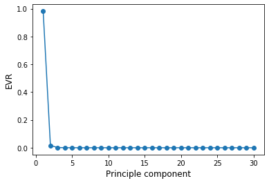

```python
import numpy as np
import matplotlib as mpl
import matplotlib.pyplot as plt
from sklearn import datasets
```

# Principle component analysis (PCA)

In scientific settings, we usually deal with datasets of high dimension, i.e. many features. In order to interpret such datasets, we have to reduce their dimensionality in an interpretable way, such that most of the information in the data is preserved. Many techniques exist for this purpose, but in this exercise we want to focus on principal component analysis (PCA). Its idea is simple—reduce the dimensionality of a dataset, for instance by combining features, while preserving as much ‘variability’ (i.e. statistical information) as possible.

In this exercise we will be using the Wisconsin breast cancer dataset, which consists of 596 samples and 30 features. The features are computed from a digitized image of a fine needle aspirate (FNA) of a breast mass. They describe characteristics of the cell nuclei present in the image and are linked with a label, malignant or benign.


```python
data = datasets.load_breast_cancer()
```


```python
X = data.data
y = data.target
```

Following the procedure in chapter 2.1 of the lecture notes, we write a Python function that implements PCA. The input to this function should be the data itself and a variable specifying the number of components we want to keep.


```python
def pca(X, n_components):
    
    # Center the data by subtracting from each column the mean of that column
    X_centered = X - X.mean(axis=0)
    
    # Form the n by n covariance matrix
    C = np.cov(X.T)
    
    # Diagonalize the matrix 
    L, W = np.linalg.eig(C)
    
    # Sort the eigenvalues and vectors from largest to smallest
    idx = L.argsort()[::-1]   
    L = L[idx]
    W = W[:,idx]
    
    # Keep only the n_components largest eigenvectors
    Wtilde = W[:, :n_components]
    
    # Transform initial data
    X_pca = X_centered.dot(Wtilde)
    
    return X_pca
```

Let's apply this to our dataset:


```python
# Select number of components
n_components = 2

# Apply our pca function
X_pca = pca(X, n_components)
```

Lets take a look at the original and the transformed data...


```python
# Get class labels as marker style for the plot
idx_0 = np.where(y==0)
idx_1 = np.where(y==1)
```


```python
# Plot the relations between the first 5 features

fig, axs = plt.subplots(5, 5,figsize=(15,15))

for i in range(0,5):
    for j in range(0,5):
        axs[i,j].plot(X[idx_0, i], X[idx_0, j], "b+", label="y = 0")
        axs[i,j].plot(X[idx_1, i], X[idx_1, j], "kx", label="y = 1")

plt.tight_layout()
plt.show()
```


    

    


```python
# Now lets look at the compressed version..
plt.plot(X_pca[idx_0, 0], X_pca[idx_0, 1], "b+", label="y = 0")
plt.plot(X_pca[idx_1, 0], X_pca[idx_1, 1], "kx", label="y = 0")
plt.ylabel("PCA Component 2", fontsize=12)
plt.xlabel("PCA Component 1", fontsize=12)
plt.show()
```


    

    


We can see that the two components we selected are not fully separating the two classes, however already simplify the problem. Note also that component 1 (x-axis) shows a larger variation in the data set as component 2, carying more information.

Most machine learning algorithms are already implemented in highly efficient packages. We can now compare our implementation with the sklearn library:


```python
from sklearn.decomposition import PCA

skl_pca = PCA(n_components)
X_skl_pca = skl_pca.fit_transform(X)
```

Lets check whether this is the same as before... Note: Eigenvectors that are calculated in any software package are unique up to a sign flip. 


```python
X_skl_pca[:3]
```


    array([[1160.1425737 , -293.91754364],
           [1269.12244319,   15.63018184],
           [ 995.79388896,   39.15674324]])


```python
X_pca[:3]
```


    array([[1160.1425737 , -293.91754364],
           [1269.12244319,   15.63018184],
           [ 995.79388896,   39.15674324]])


Selecting the right number of components in PCA is crucial, as we might loose vital information. In order to make an informed decision, we compute the explained variance ratio given,defined as the variance of a principle component divided by the total variance. Equivalently, this can be calculated as

```{math}
PVE_i = \frac{\Lambda_i}{\sum_j \Lambda_j},
```
where $\Lambda_i$ is the eigenvalue of the ith principle component.


```python
# Center the data by subtracting from each column the mean of that column
X_centered = X - X.mean(axis=0)
    
# Form the n by n covariance matrix
C = np.cov(X.T)

# Diagonalize the matrix 
L, W = np.linalg.eig(C)

EVR = L/np.sum(L)
```


```python
plt.plot(np.arange(1,len(L)+1), EVR, "-o")
plt.ylabel("EVR", fontsize=12)
plt.xlabel("Principle component", fontsize=12)
plt.show()
```


    

    


This is called scree plot. An ideal curve should be steep, then bends at an “elbow” — this is our cutting-off point — and after that flattens out.

What information did we loose by selecting n_components?


```python
print(np.round((1 - np.sum(EVR[:n_components]))*100,1),"%")
```

    0.2 %


Reasons why you might want to avoid PCA are:

* Susceptibility to outliers
* Intepretability of features: After implementing PCA on the dataset, your original features will turn into Principal Components. Principal Components are the linear combination of your original features. Principal Components are not as readable and interpretable as original features.

* Data standardization is a must: You must standardize your data before implementing PCA, otherwise PCA will not be able to find the optimal principal components. This also means that categorical features first have to be converted into numerical ones.
