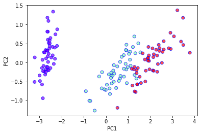
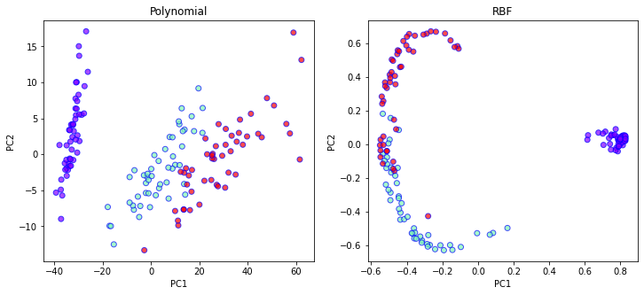
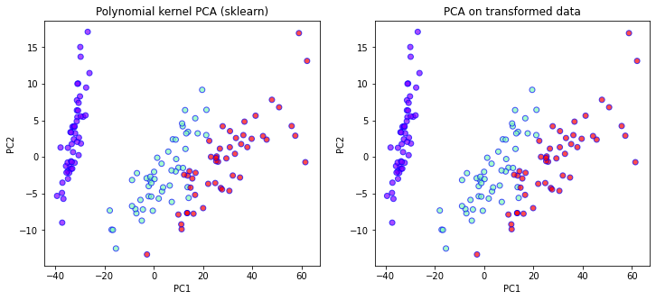
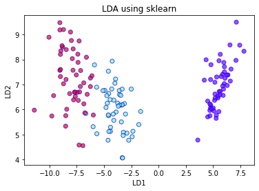
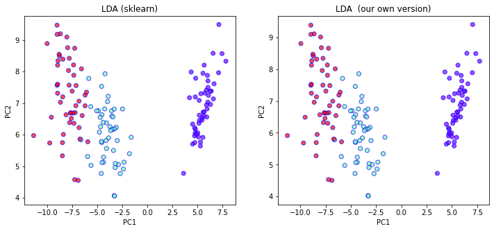

```python
# Libraries we need for this task
import numpy as np
from numpy.linalg import norm

import matplotlib.pyplot as plt


from scipy import linalg
from scipy.spatial.distance import pdist, squareform
from scipy.linalg import svd

import sklearn as sk
from sklearn.datasets import load_iris, load_breast_cancer, load_digits
from sklearn.decomposition import PCA, KernelPCA
from sklearn.discriminant_analysis import LinearDiscriminantAnalysis
from sklearn.manifold import TSNE
```

# Exercise: Dimensionality Reduction

Very often, we are presented with data containing many features, i.e. high dimensional data. The aim of dimensionality reduction is, as the name implies, to reduce the number of dimensions or features of the dataset.
Some reasons why we might want to reduce dimensions include:

* eliminate ``useless" features,

* speeds up other algorithms,

* data visualisation.


In the following, we will compare four different methods for achieving such a task: 1) Principle Component Analysis (PCA), 2) Kernel Principle Component Analysis (kPCA) and 3) Linear Discriminant Analysis (LDA) 4) t-SNE. For this exercise, we shall use the labelled Iris dataset provided within Scikit-Learn by calling **sklearn.datasets.load_iris()**. The dataset consist of 150 samples each with 4 features.


```python
data = load_iris()
X = data['data']
Y = data['target']
print(X.shape)
```

    (150, 4)


## Principle Component Analysis


```python
pca = PCA(n_components=2)
X_pca = pca.fit_transform(X)
plt.xlabel('PC1')
plt.ylabel('PC2')
plt.scatter(
    X_pca[:,0],
    X_pca[:,1],
    c=Y,
    cmap='rainbow',
    alpha=0.7,
    edgecolors='b'
)

```


    

    


Recall that the first principle component is given by the eigenvector $\boldsymbol{w}$ corresponding to the largest eigenvalue of the covariance matrix $C = X^{T}X$. The vector $\boldsymbol{w}$ defines a linear combination of features which transforms a datapoint as $\boldsymbol{x} \rightarrow \boldsymbol{x} \cdot \boldsymbol{w} = \boldsymbol{x}'$. What is the variance of the transformed data $\boldsymbol{x}'$ in terms of the original covariance matrix?


If the data is transformed as
```{math}
    x \rightarrow x' = x \cdot w
```
then the variance of the transformed data $x'$ is given by (assuming the data is centred)
```{math}
   \frac{1}{N} \sum_{i} {x'}_{i}^{2} = \frac{1}{N} \sum_{i} (x_i^{T} w)^{T} (x_i^{T} w) = 
   \frac{1}{N} w^{T} \left( \sum_{i} x_i x_i^{T} \right) w = w^{T} C w.
```


We have seen that the first principle component $w$ corresponds to the eigenvector of the largest eigenvalue of the covariance matrix. Assuming that the data is centred, the covariance matrix is given by 
```{math}
C = X^{T}X.
```
Notice that for any vector $v$,
```{math}
    v^{T} C v = (Xv)^{T} (Xv) \geq 0.
```
Since $C$ is symmetric, i.e. $C = C^{T}$, there exist a complete orthonormal basis $\lbrace w_i \rbrace$  with corresponding eigenvalues $\lambda_1 > \lambda_2 > \lambda_3 > \cdots$. The problem is then to show that 
```{math}
    w_1  = \text{arg}\max\limits_{\boldsymbol{w}} \lbrace \frac{w^{T}Cw}{w^{T}w} \rbrace .
```
Given such an orthonormal basis, any vector $v$ can be expressed in an orthonormal eigenbasis $\lbrace w_i \rbrace$ of $C$, such that
```{math}
    v = \sum_{i} a_i w_i
```
where $a_i$ are real coefficients.

This decomposition then allows us to write
```{math}
    R(v) = \frac{v^{T}Cv}{v^{T}v} = \sum_{i} \lambda_i \alpha_i^2.
```
where $\alpha_i^2 = \frac{a_{i}^{2}}{\sum_{j} a_{j}^{2}}$. 
Since $\alpha_i^2 > 0$ and $\sum_{i}\alpha_i^2 = 1$, the rayleigh quotient $R(v)$ is maximised when 
```{math}
\alpha_1 = 1, \alpha_2 = 0, \alpha_3 = 0, \cdots
```
This precisely corresponds to the case where 
```{math}
    v \propto w_1
```

Thus, we can conclude that
```{math}
w_1  = \text{arg}\max\limits_{\boldsymbol{w}} \lbrace \frac{w^{T}Cw}{w^{T}w} \rbrace .
```

This result highlights the fact that PCA is essentially finding the linear combination of features which maximises the variance.

## Kernel PCA


```python
# Polynomial Kernel
kpca_poly = KernelPCA(n_components=2, kernel='poly', degree=2, gamma=1, coef0=0.5)
X_kpca_poly = kpca_poly.fit_transform(X)

# RBF Kernel
kpca_rbf = KernelPCA(n_components=2, kernel='rbf')
X_kpca_rbf = kpca_rbf.fit_transform(X)

fig, ax = plt.subplots(1, 2, figsize=(12,5))
ax[0].set_xlabel('PC1')
ax[0].set_ylabel('PC2')
ax[0].set_title("Polynomial")
ax[0].scatter(
    X_kpca_poly[:,0],
    X_kpca_poly[:,1],
    c=Y,
    cmap='rainbow',
    alpha=0.7,
    edgecolors='b'
)

ax[1].set_xlabel('PC1')
ax[1].set_ylabel('PC2')
ax[1].set_title("RBF")
ax[1].scatter(
    X_kpca_rbf[:,0],
    X_kpca_rbf[:,1],
    c=Y,
    cmap='rainbow',
    alpha=0.7,
    edgecolors='b'
)
```


    &lt;matplotlib.collections.PathCollection at 0x7fc4e47d8e90&gt;


    

    


To get a better understanding of the inner workings of kernel PCA, let us try to implement it on our own. We shall do so in two ways. First by explicitly mapping our data to higher dimension using a non-linear map $g: R^{d} \rightarrow R^{k}$ and second by using the kernel trick.

Let us consider a second order polynomial map $ \boldsymbol{x} \rightarrow (0.5, x_1,\dots, x_d, x^2_1, \dots x^2_d, x_1 x_2, x_1 x_3, \dots)$ which effectively adds a square of the number of features. 


```python
# Transform the data according to the polynomial map
X2 = np.concatenate((0.5*np.ones((X.shape[0],1)),X,np.einsum("ij, ik->ijk", X, X).reshape(X.shape[0],-1)),axis=1)
print("X2 shape =", X2.shape)

# Perform PCA on the transformed data
pca = PCA(n_components=2)
X2_pca = pca.fit_transform(X2)

fig, ax = plt.subplots(1, 2, figsize=(12,5))
ax[0].set_xlabel('PC1')
ax[0].set_ylabel('PC2')
ax[0].set_title("Polynomial kernel PCA (sklearn)")
ax[0].scatter(
    X_kpca_poly[:,0],
    X_kpca_poly[:,1],
    c=Y,
    cmap='rainbow',
    alpha=0.7,
    edgecolors='b'
)
ax[1].set_xlabel('PC1')
ax[1].set_ylabel('PC2')
ax[1].set_title("PCA on transformed data")
ax[1].scatter(
    X2_pca[:,0],
    X2_pca[:,1],
    c=Y,
    cmap='rainbow',
    alpha=0.7,
    edgecolors='b'
)
```

    X2 shape = (150, 21)


    

    


Comparing the two plots above we see that indeed the two results match up exactly. Now lets see how we can implement the kernel trick.


```python
# Construct the kernel
def make_polykernel(X, degree=2, gamma=1.0, coef0=0.5):
    K = X.dot(X.T)
    K *= gamma
    K += coef0
    K **= degree
    return K

# Kernel PCA    
def polykernel_pca(X, n=2, degree=2, gamma=1.0, coef0=0.5):
    K = make_polykernel(X, degree=degree,
                        gamma=gamma, coef0=coef0)
    N = K.shape[0]
    one_n = np.ones((N, N)) / N

    # This step helps to standardise the data to have zero mean (c.f. PCA)
    K = K - one_n.dot(K) - K.dot(one_n) + one_n.dot(K).dot(one_n)

    # Get the eigenvalues/eigenvectors
    _, eigen_values, eigen_vectors = svd(K)
    return (eigen_vectors[:n, :].T * np.sqrt(np.abs(eigen_values[:n])))

X2_transformed = polykernel_pca(X, degree=2, gamma=1, coef0=0.5)

fig, ax = plt.subplots(1, 2, figsize=(12,5))
ax[0].set_xlabel('PC1')
ax[0].set_ylabel('PC2')
ax[0].set_title("Polynomial kernel PCA (sklearn)")
ax[0].scatter(
    X_kpca_poly[:,0],
    X_kpca_poly[:,1],
    c=Y,
    cmap='rainbow',
    alpha=0.7,
    edgecolors='b'
)
ax[1].set_xlabel('PC1')
ax[1].set_ylabel('PC2')
ax[1].set_title("Polynomial kernel PCA  (our own version)")
ax[1].scatter(
    X2_transformed[:,0],
    X2_transformed[:,1],
    c=Y,
    cmap='rainbow',
    alpha=0.7,
    edgecolors='b'
)
```


    

    


## Linear Discriminant Analysis
Unlike PCA or kernel PCA, LDA uses labelled data, i.e it is a supervised algorithm. Let's first use the sklearn's built-in LDA module. Later we shall try to do it "ourselves", using just numpy.


```python
lda = LinearDiscriminantAnalysis(n_components=2, solver='eigen')
X_lda = lda.fit_transform(X, Y)
plt.xlabel('LD1')
plt.ylabel('LD2')
plt.title('LDA using sklearn')
plt.scatter(
    X_lda[:,0],
    X_lda[:,1],
    c=Y,
    cmap='rainbow',
    alpha=0.7,
    edgecolors='b'
)
```


    

    


We have already seen in detail how PCA works. To get a better understanding of what actually happens when we do LDA, let us try to implement it ourselves. First, let us write down the algorithm.

### LDA algorithm

1) For each class k, compute the mean $\mu_k$ and the within-class scatter matrix given by 

```{math}
W = \sum_{k} S_k 
```

where $S_k = \sum_{i} (x_i -\mu_k)(x_i -\mu_k)^{T}$. 

2) Considering the class means $\mu_k$ as a set of data points, compute the between-class scatter

```{math}
 B = \sum_{k} N_{k} (\mu_{k} - \mu)(\mu_{k} - \mu)^{T}
```

where $\mu$ is the global average and $N_k$ is the size of each class.

3) Compute the eigenvalues and eigenvectors of $W^{-1}B$

4) Select the eigenvectors corresponding to the $l$ largest eigenvalues and construct the transformation matrix

```{math}
 U = [v_1 \dots v_l] 
```

and the data can then be transformed as $X' = XU$.


```python
# Divide the dataset into its individual classes
X_part = []
for e in set(Y):
    X_part.append(X[Y==e])

# Count the number of samples in each class
Nk = np.array([len(x) for x in X_part])

# Obtain the global mean value across the whole dataset
g_mu = np.mean(X, axis=0)

# Obtain the mean value on each class of data
mu = np.array([np.mean(x,axis=0) for x in X_part])

# Compute the within-class covariance/scatter matrix
W = np.mean([np.cov(x.transpose(), bias=False) for x in X_part], axis=0)

# Compute the between-class covariance/scatter matrix
B = np.einsum("k, ki, kj -> ij", Nk, mu-g_mu, mu-g_mu)

# Get the eigenvectors and eigenvalues of W^-1 B
vals, vecs = linalg.eigh(B, W)
idx = np.argsort(vals)[::-1]
vecs = vecs[:,idx]

# Transform the data according to the two largest eigenvalues
X_myLDA = X.dot(vecs[:,:2])

# Plot and compare with sklearn
fig, ax = plt.subplots(1, 2, figsize=(12,5))
ax[0].set_xlabel('PC1')
ax[0].set_ylabel('PC2')
ax[0].set_title("LDA (sklearn)")
ax[0].scatter(
    X_lda[:,0],
    X_lda[:,1],
    c=Y,
    cmap='rainbow',
    alpha=0.7,
    edgecolors='b'
)
ax[1].set_xlabel('PC1')
ax[1].set_ylabel('PC2')
ax[1].set_title("LDA  (our own version)")
ax[1].scatter(
    X_myLDA[:,0],
    X_myLDA[:,1],
    c=Y,
    cmap='rainbow',
    alpha=0.7,
    edgecolors='b'
)
```


    

    


Notice that the two plots matches perfectly. Depending on how you found the eigenvalues/eigenvectors, your result might differ up to some scaling of the axes.

Each of the three methods so far essentially produced a new feature by considering linear/non-linear transformation of the original features. By looking only at the first principle component of each of the three methods so far, which method gave the most useful feature if one was interested in a classification task?

LDA would give more useful information in this case since its aim is actually separate the data from different classes. On the other hand, PCA or kernel PCA is actually agnostic to the classification of each data point. The primary aim of PCA or kernel PCA is to maximise variance. However, it is not a priori true that features with maximal variance carries the most (or even any) significance in terms of data classification.


Let us try to understand the rationale behind the LDA. In PCA, we know that the aim was maximise the variance across the sample, i.e. the first principle component maximises sample variance. There is actually a similar intuitive idea underlying the LDA, attributed to Fisher.

Consider a linear combination of features defined by $x \cdot v$. The mean and scatter matrices will then be given by $\mu_k \cdot v$ and $v^{T}S v$.

Fisher defined the quantity called the separation as
```{math}
 S(v) = \frac{B(v)}{W(v)}
```
where $v$ is a feature vector, i.e. $x' = Xv$, and 
```{math}
B(v) = \sum_{k} N_{k} v^{T}(\mu_{k} - \mu)(\mu_{k} - \mu)^{T}v = v^{T}Bv
```
and 
```{math}
W(v) = v^{T}Wv
```
Hence, 
```{math}
 S(v) =  \frac{v^{T}Bv}{v^{T}Wv} 
```
Notice that if $W^{-1}Bv = \lambda v$, 
```{math}
 S(v) = \frac{v^{T}WW^{-1}Bv}{v^{T}Wv} = \frac{\lambda v^{T}Wv}{v^{T}Wv} = \lambda
```

Lastly, to see that the largest eigenvector of $W^{-1}B$ is also the the maximiser of $S$, simply note that the problem can be restated as
```{math}
 \textrm{maximise } v^{T}Bv
```
subject to the constraint
```{math}
 v^{T}Wv = 1 
```
This can be solved using the Lagrangian multiplier
```{math}
 \mathcal{L} = v^{T}Bv - \lambda v^{T}Wv 
```

Taking partial derivative w.r.t. $v$ and $\lambda$ then yields

```{math}
 Bv = \lambda Wv 
```

which is exactly the result we were looking for.

The key assumption in LDA is that the covariances of the different classes are equal.


## t-SNE

We have already seen 3 related algorithms for dimensionality reduction. One of the key reasons for performing such a reduction is simply so that we can plot them as a 1D/2D/3D image. This is called data visualisation. Another popular method for such a task is known as t-SNE. Unlike the earlier dimensionality reduction algorithms, t-SNE is primarily a data visualisation tool and it is not trivial to extend it to new data. Before explaining further, let us first look at what t-SNE does to our Iris dataset.


```python
tsne = TSNE(n_components=2, verbose=1, perplexity=40, n_iter=300)
tsne_results = tsne.fit_transform(X)
plt.xlabel('TS1')
plt.ylabel('TS2')
plt.scatter(
    tsne_results[:,0],
    tsne_results[:,1],
    c=Y,
    cmap='rainbow',
    alpha=0.7,
    edgecolors='b'
)
```

    [t-SNE] Computing 121 nearest neighbors...
    [t-SNE] Indexed 150 samples in 0.000s...
    [t-SNE] Computed neighbors for 150 samples in 0.005s...
    [t-SNE] Computed conditional probabilities for sample 150 / 150
    [t-SNE] Mean sigma: 0.667454
    [t-SNE] KL divergence after 250 iterations with early exaggeration: 47.299500
    [t-SNE] KL divergence after 300 iterations: 0.093748


    

    


### t-SNE algorithm

Let us now briefly recall how t-SNE is implemented:

1)Randomly map $x_i \in R^d \rightarrow y_i \in R^{l}$

2)Compute the probabilities $p_{ij}$ and $q_{ij}$ corresponding to $x$ and $y$ respectively.

3)Minimise the KL divergence between $p_{ij}$ and $q_{ij}$ by shifting the mapped variables $y_i$, using gradient descent.

By analysing this procedure, we can see that t-SNE directly transform the data points in the sample. It does not actually 'learn' a transformation which can then be applied to new data points. 
 

Even though t-SNE might not be suitable for preprocessing data, it is still useful for visualising the data and also providing useful (albeit misleading at times) information regarding the clustering properties of the data.


```python
mnist = load_digits()
X_mnist = mnist.data 
Y_mnist = mnist.target
print(X_mnist.shape)

tsne = TSNE(n_components=2, verbose=1, perplexity=40, n_iter=300)
mnist_tsne_results = tsne.fit_transform(X_mnist)

plt.xlabel('TS1')
plt.ylabel('TS2')
plt.scatter(
    mnist_tsne_results[:,0],
    mnist_tsne_results[:,1],
    c=Y_mnist,
    cmap='rainbow',
    alpha=0.9,
    edgecolors='b'
)

```

    (1797, 64)
    [t-SNE] Computing 121 nearest neighbors...
    [t-SNE] Indexed 1797 samples in 0.003s...
    [t-SNE] Computed neighbors for 1797 samples in 0.284s...
    [t-SNE] Computed conditional probabilities for sample 1000 / 1797
    [t-SNE] Computed conditional probabilities for sample 1797 / 1797
    [t-SNE] Mean sigma: 8.394135
    [t-SNE] KL divergence after 250 iterations with early exaggeration: 62.007500
    [t-SNE] KL divergence after 300 iterations: 0.964586


    

    


There does indeed seem to be of the order 10 distinct clusters of data. Although for this case we already knew the answer, in an unsupervised setting where the data is unlabelled, such information can be extremely useful
