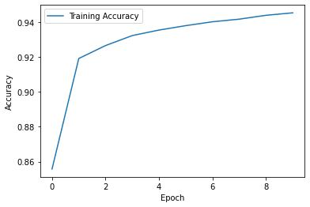
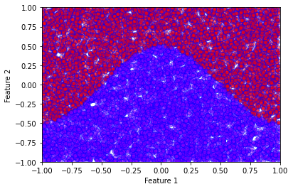

<!-- Global site tag (gtag.js) - Google Analytics -->

<script async src="https://www.googletagmanager.com/gtag/js?id=G-ZLMLLKHZE0"></script>
<script>
  window.dataLayer = window.dataLayer || [];
  function gtag(){dataLayer.push(arguments);}
  gtag('js', new Date());

  gtag('config', 'G-ZLMLLKHZE0');
</script>
```python
from sklearn.datasets import load_breast_cancer, load_iris
from sklearn.discriminant_analysis import LinearDiscriminantAnalysis
from sklearn.decomposition import PCA
from sklearn.linear_model import LogisticRegression
import matplotlib.pyplot as plt
import numpy as np
from scipy.stats import multivariate_normal
from scipy.special import softmax
from scipy import sparse
from itertools import product
from tensorflow import keras
```

# Exercise: Dense Neural Networks

In this exercise, we shall train a simple dense neural network classifier for the MNIST handwritten digits dataset available within tensorflow. The dataset consist of images of handwritten digits with 28 by 28 pixels.

## Loading the MNIST dataset


```python
# Load Dataset 
(x_train , y_train), (x_test , y_test) = keras.datasets.mnist.load_data()

# Standardise the data to have a spread of 1
x_train, x_test = x_train / 255.0, x_test / 255.0

plt.imshow(x_train[0])
```


   


    

    


## Define the network


```python
# Define the model
model = keras.Sequential([
    keras.layers.Flatten(input_shape=(28,28)),
    keras.layers.Dense(12, activation='relu'),
    keras.layers.Dense(10, activation='softmax')
])
```

The softmax activation in the final layer ensures that the output can be treated as a probability distribution over the 10 possible classes, i.e. the model defines the function 

```{math}
\boldsymbol{f}: \mathbb{R}^{28 \times 28} \rightarrow \mathbb{R}^{10}
```

where the output $\boldsymbol{f}(\boldsymbol{x})$ satisfies

```{math}
\begin{split}
& f_{i}(\boldsymbol{x}) \geq 0 \ \ \textrm{for}\ \  i = 0, 1, \dots, 9 \\
& \sum_{i=0}^{9}  f_{i}(\boldsymbol{x}) = 1.
\end{split}
```


```python
# Lets look at the model's prediction before training it
pred = model(x_train[0:1])
print(pred.numpy())
plt.plot(pred[0])
plt.xlabel('Classification')
plt.ylabel('Probability')
plt.show()
```

    [[0.0934115  0.1345084  0.06015386 0.17981586 0.16215855 0.09857295
      0.10626732 0.06349586 0.05087668 0.05073911]]


    

    


## Choosing an optimizer and a loss function

We chose the ADAM optimizer (Don't worry about the details of the optimizer, you will learn about them in the next task. For now, it is enough to know that this is similar to stochastic gradient descent.). The loss function here is known as the cross entropy defined as 

```{math}
L = -\sum_{i=0}^{9} y_i \log(f_i(\boldsymbol{x}))
```

where $y_i = 1$ if the true classification of the sample $\boldsymbol{x}$ is $i$, otherwise $y_i = 0$. The function $f_i(\boldsymbol{x})$ is the probability distribution defined above. 


```python
# Compile and train the model
model.compile(optimizer='adam',
              loss=keras.losses.SparseCategoricalCrossentropy(),
              metrics=['accuracy'])
history = model.fit(x_train, y_train, validation_data=(x_test, y_test), epochs=10, batch_size=32)
```

    Epoch 1/10
    1875/1875 [==============================] - 1s 751us/step - loss: 0.5062 - accuracy: 0.8557 - val_loss: 0.2964 - val_accuracy: 0.9141
    Epoch 2/10
    1875/1875 [==============================] - 1s 689us/step - loss: 0.2816 - accuracy: 0.9193 - val_loss: 0.2613 - val_accuracy: 0.9223
    Epoch 3/10
    1875/1875 [==============================] - 1s 618us/step - loss: 0.2522 - accuracy: 0.9267 - val_loss: 0.2421 - val_accuracy: 0.9299
    Epoch 4/10
    1875/1875 [==============================] - 1s 624us/step - loss: 0.2357 - accuracy: 0.9324 - val_loss: 0.2241 - val_accuracy: 0.9336
    Epoch 5/10
    1875/1875 [==============================] - 1s 628us/step - loss: 0.2237 - accuracy: 0.9356 - val_loss: 0.2210 - val_accuracy: 0.9345
    Epoch 6/10
    1875/1875 [==============================] - 1s 606us/step - loss: 0.2143 - accuracy: 0.9381 - val_loss: 0.2221 - val_accuracy: 0.9345
    Epoch 7/10
    1875/1875 [==============================] - 1s 628us/step - loss: 0.2071 - accuracy: 0.9404 - val_loss: 0.2110 - val_accuracy: 0.9384
    Epoch 8/10
    1875/1875 [==============================] - 1s 614us/step - loss: 0.2009 - accuracy: 0.9419 - val_loss: 0.2109 - val_accuracy: 0.9376
    Epoch 9/10
    1875/1875 [==============================] - 1s 616us/step - loss: 0.1946 - accuracy: 0.9441 - val_loss: 0.2110 - val_accuracy: 0.9379
    Epoch 10/10
    1875/1875 [==============================] - 1s 611us/step - loss: 0.1894 - accuracy: 0.9455 - val_loss: 0.2092 - val_accuracy: 0.9386


```python
# The model's predicition after training now makes sense!
pred = model(x_train[0:1])
print(pred.numpy())
plt.plot(pred[0])
plt.xlabel('Classification')
plt.ylabel('Probability')
plt.show()
```

    [[4.9257022e-05 2.3301787e-05 3.0720589e-04 3.1944558e-01 3.5377405e-09
      6.7966461e-01 7.4789693e-07 4.9926934e-04 1.5144547e-06 8.4192516e-06]]


    

    


```python
# We can also look at the optimisation history
plt.plot(history.history['accuracy'], label='Training Accuracy')
plt.xlabel('Epoch')
plt.ylabel('Accuracy')
plt.legend()
plt.show()
```


    

    


## Comparing Neural Networks with Logistic Regression

If one looks closely at the functional form of the LR model and compares it with a simple dense neural network, one would notice that the LR model is simply a "neural network" without hidden layers. To investigate this, we consider a fictitious 2-dimensional dataset with 2 classes constructed as follows. The data points $\boldsymbol{x} \in \mathbb{R}^2$ are uniformly sampled within a square such that $-1\leq x_0 \leq 1$  and $-1\leq x_1 \leq 1$. The data point belongs to the class $1$ if 

```{math}
x_1 \leq 0.5 \sin(2\pi x_0) 
```

otherwise, it belongs to class $2$. The dataset can be created with the code snippet below: 


```python
# Construct the dataset
sX = np.random.uniform(low=-1, high=1, size=(10000,2))
sY = np.array([0 if s[1]<=0.5*np.cos(np.pi*s[0]) else 1 for s in sX])
plt.xlabel('Feature 1')
plt.ylabel('Feature 2')
plt.ylim(-5,5)
plt.scatter(
    sX[:,0],
    sX[:,1],
    c=sY,
    cmap='rainbow',
    alpha=0.5,
    edgecolors='b'
)
plt.xlim(-1,1)
plt.ylim(-1,1)
plt.show()
```


    

    


```python
# Use sklearn's Logistic regression method
clf = LogisticRegression(random_state=0).fit(sX, sY)
predictions = clf.predict(sX)
acc = len(np.where(sY == predictions)[0])/10000
print("LR Accuracy =", acc)
plt.xlabel('PC1')
plt.ylabel('PC2')
plt.ylim(-5,5)
plt.scatter(
    sX[:,0],
    sX[:,1],
    c=predictions,
    cmap='rainbow',
    alpha=0.5,
    edgecolors='b'
)
plt.xlim(-1,1)
plt.ylim(-1,1)
plt.show()
```

    LR Accuracy = 0.8439


    

    


We see very clearly the linear decision boundary of the logistic regression method. This is clearly not sufficient to correctly classify this fictitious data. We now proceed to a simple neural network solution.


```python
def single_layer_model(h):
    model = keras.Sequential([
    keras.layers.Dense(h, activation='tanh'),
    keras.layers.Dense(2, activation='softmax')
    ])
    model.compile(optimizer='adam', loss=keras.losses.SparseCategoricalCrossentropy(),metrics=['accuracy'])
    return model

# A simple neural network with 2 hidden units
model = single_layer_model(2)
model.fit(sX,sY,epochs=50,batch_size=32)
```

    Epoch 1/50
    313/313 [==============================] - 0s 880us/step - loss: 0.4734 - accuracy: 0.8328
    Epoch 2/50
    313/313 [==============================] - 0s 618us/step - loss: 0.3799 - accuracy: 0.8492
    Epoch 3/50
    313/313 [==============================] - 0s 428us/step - loss: 0.3376 - accuracy: 0.8499
    Epoch 4/50
    313/313 [==============================] - 0s 430us/step - loss: 0.3190 - accuracy: 0.8517
    Epoch 5/50
    313/313 [==============================] - 0s 429us/step - loss: 0.3082 - accuracy: 0.8543
    Epoch 6/50
    313/313 [==============================] - 0s 437us/step - loss: 0.2987 - accuracy: 0.8592
    Epoch 7/50
    313/313 [==============================] - 0s 427us/step - loss: 0.2874 - accuracy: 0.8652
    Epoch 8/50
    313/313 [==============================] - 0s 428us/step - loss: 0.2743 - accuracy: 0.8720
    Epoch 9/50
    313/313 [==============================] - 0s 425us/step - loss: 0.2596 - accuracy: 0.8804
    Epoch 10/50
    313/313 [==============================] - 0s 436us/step - loss: 0.2439 - accuracy: 0.8910
    Epoch 11/50
    313/313 [==============================] - 0s 433us/step - loss: 0.2279 - accuracy: 0.9028
    Epoch 12/50
    313/313 [==============================] - 0s 429us/step - loss: 0.2122 - accuracy: 0.9130
    Epoch 13/50
    313/313 [==============================] - 0s 436us/step - loss: 0.1969 - accuracy: 0.9243
    Epoch 14/50
    313/313 [==============================] - 0s 426us/step - loss: 0.1830 - accuracy: 0.9329
    Epoch 15/50
    313/313 [==============================] - 0s 428us/step - loss: 0.1700 - accuracy: 0.9404
    Epoch 16/50
    313/313 [==============================] - 0s 427us/step - loss: 0.1581 - accuracy: 0.9482
    Epoch 17/50
    313/313 [==============================] - 0s 428us/step - loss: 0.1472 - accuracy: 0.9539
    Epoch 18/50
    313/313 [==============================] - 0s 430us/step - loss: 0.1376 - accuracy: 0.9569
    Epoch 19/50
    313/313 [==============================] - 0s 426us/step - loss: 0.1290 - accuracy: 0.9614
    Epoch 20/50
    313/313 [==============================] - 0s 427us/step - loss: 0.1212 - accuracy: 0.9631
    Epoch 21/50
    313/313 [==============================] - 0s 432us/step - loss: 0.1144 - accuracy: 0.9661
    Epoch 22/50
    313/313 [==============================] - 0s 437us/step - loss: 0.1083 - accuracy: 0.9689
    Epoch 23/50
    313/313 [==============================] - 0s 426us/step - loss: 0.1029 - accuracy: 0.9702
    Epoch 24/50
    313/313 [==============================] - 0s 430us/step - loss: 0.0982 - accuracy: 0.9722
    Epoch 25/50
    313/313 [==============================] - 0s 427us/step - loss: 0.0938 - accuracy: 0.9718
    Epoch 26/50
    313/313 [==============================] - 0s 448us/step - loss: 0.0899 - accuracy: 0.9734
    Epoch 27/50
    313/313 [==============================] - 0s 426us/step - loss: 0.0865 - accuracy: 0.9741
    Epoch 28/50
    313/313 [==============================] - 0s 434us/step - loss: 0.0834 - accuracy: 0.9741
    Epoch 29/50
    313/313 [==============================] - 0s 427us/step - loss: 0.0806 - accuracy: 0.9750
    Epoch 30/50
    313/313 [==============================] - 0s 428us/step - loss: 0.0781 - accuracy: 0.9756
    Epoch 31/50
    313/313 [==============================] - 0s 426us/step - loss: 0.0757 - accuracy: 0.9763
    Epoch 32/50
    313/313 [==============================] - 0s 430us/step - loss: 0.0735 - accuracy: 0.9759
    Epoch 33/50
    313/313 [==============================] - 0s 429us/step - loss: 0.0716 - accuracy: 0.9771
    Epoch 34/50
    313/313 [==============================] - 0s 427us/step - loss: 0.0698 - accuracy: 0.9776
    Epoch 35/50
    313/313 [==============================] - 0s 430us/step - loss: 0.0682 - accuracy: 0.9780
    Epoch 36/50
    313/313 [==============================] - 0s 433us/step - loss: 0.0667 - accuracy: 0.9784
    Epoch 37/50
    313/313 [==============================] - 0s 428us/step - loss: 0.0653 - accuracy: 0.9787
    Epoch 38/50
    313/313 [==============================] - 0s 431us/step - loss: 0.0640 - accuracy: 0.9787
    Epoch 39/50
    313/313 [==============================] - 0s 437us/step - loss: 0.0627 - accuracy: 0.9793
    Epoch 40/50
    313/313 [==============================] - 0s 430us/step - loss: 0.0616 - accuracy: 0.9792
    Epoch 41/50
    313/313 [==============================] - 0s 427us/step - loss: 0.0604 - accuracy: 0.9793
    Epoch 42/50
    313/313 [==============================] - 0s 439us/step - loss: 0.0594 - accuracy: 0.9797
    Epoch 43/50
    313/313 [==============================] - 0s 435us/step - loss: 0.0585 - accuracy: 0.9795
    Epoch 44/50
    313/313 [==============================] - 0s 431us/step - loss: 0.0576 - accuracy: 0.9802
    Epoch 45/50
    313/313 [==============================] - 0s 430us/step - loss: 0.0568 - accuracy: 0.9802
    Epoch 46/50
    313/313 [==============================] - 0s 430us/step - loss: 0.0559 - accuracy: 0.9797
    Epoch 47/50
    313/313 [==============================] - 0s 539us/step - loss: 0.0552 - accuracy: 0.9802
    Epoch 48/50
    313/313 [==============================] - 0s 433us/step - loss: 0.0545 - accuracy: 0.9805
    Epoch 49/50
    313/313 [==============================] - 0s 427us/step - loss: 0.0538 - accuracy: 0.9807
    Epoch 50/50
    313/313 [==============================] - 0s 427us/step - loss: 0.0531 - accuracy: 0.9814


   


Since the network is non-linear, it is not straightforward to derive an explicit formula for the boundary, but we can simply evaluate the network on a grid and plot the result.

The functional form of this neural network is given by

```{math}
\boldsymbol{f}(\boldsymbol{x}) =  \sigma(W^{(2)} \tanh(W^{(1)}\boldsymbol{x} + \boldsymbol{b}^{(1)})+\boldsymbol{b}^{(2)})
```

where $W^{(i)}$ and $\boldsymbol{b}^{(i)}$ are the weights and biases of layer $i$. 


```python
# Use our trained neural network to predict the classes
prediction = model.predict_classes(sX)
plt.xlabel('PC1')
plt.ylabel('PC2')
plt.scatter(
    sX[:,0],
    sX[:,1],
    c=prediction,
    cmap='rainbow',
    alpha=0.5,
    edgecolors='b'
)
plt.xlim(-1,1)
plt.ylim(-1,1)
plt.show()
```


    

    


Varying the number of hidden units allows us to observe how the decision boundary changes. 


```python
# With more hidden units the accuracy increases
h = 3
model = single_layer_model(h)
hist = model.fit(sX,sY,epochs=50,batch_size=32, verbose=0)

# We can extract the weights and biases from the network 
# to plot the corresponding lines
first_layer_weights = model.layers[0].get_weights()[0]
first_layer_biases = model.layers[0].get_weights()[1]
x = np.zeros((h,2))
y = np.zeros((h,2))
for i in range(h):
    x[i,:]=np.array([-1,1])
    y[i,:]=np.array([(first_layer_weights[0,i]-first_layer_biases[i])/first_layer_weights[1,i], -(first_layer_weights[0,i]+first_layer_biases[i])/first_layer_weights[1,i]])

for i in range(h):
    plt.plot(x[i], y[i])

# Plot also the networks predictions
prediction = model.predict_classes(sX)
plt.xlabel('PC1')
plt.ylabel('PC2')
plt.scatter(
    sX[:,0],
    sX[:,1],
    c=prediction,
    cmap='rainbow',
    alpha=0.5,
    edgecolors='b'
)
plt.xlim(-1,1)
plt.ylim(-1,1)
plt.show()

```


    

    


The weights and biases from the model can be used to plot the lines defined by

```{math}
W^{(1)}_{i1} x  + W^{(1)}_{i2}  y  + b^{(1)}_{i} = 0
```

for each index $i$ (for $m$ hidden layers, $i = 1, \dots , m$). Notice that the lines somewhat mimic the decision boundary of the network.
