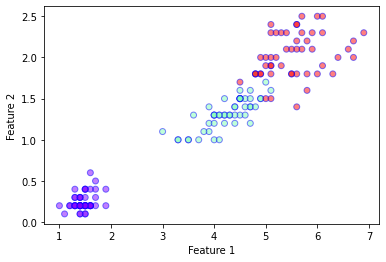

```python
from sklearn.datasets import load_breast_cancer, load_iris
from sklearn.discriminant_analysis import LinearDiscriminantAnalysis
from sklearn.decomposition import PCA
from sklearn.linear_model import LogisticRegression
import matplotlib.pyplot as plt
import numpy as np
from scipy.stats import multivariate_normal
from scipy.special import softmax
from scipy import sparse
from itertools import product
from tensorflow import keras
```

# Exercise: Classification without Neural Networks

In this exercise, we shall compare a few non-neural network classifiers for the two class dataset available by calling **sklearn.datasets.load\_iris()**. This dataset has $K=3$ classes with $p=4$ features. For ease of visualisation, we shall use only the third and fourth numerical feature, i.e. $p=2$.


```python
data = load_iris()
X = data['data']
Y = data['target']
Nsamples = X.shape[0]
Nclass = len(set(Y))

X = X[:,[2,3]]
print(X.shape)

plt.xlabel('Feature 1')
plt.ylabel('Feature 2')
plt.scatter(
    X[:,0],
    X[:,1],
    c=Y,
    cmap='rainbow',
    alpha=0.5,
    edgecolors='b'
)
plt.show()
```

    (150, 2)


    

    


## LDA Classifier

In a previous exercise, we saw that linear discriminant analysis (LDA) can be used for dimensionality reduction. The procedure can actually also be extended to create a classifier. In LDA, we assume that the conditional probability density of each class $k$ is distributed according to a multivariate Gaussian

```{math}
f_k(\boldsymbol{x}) = \frac{1}{(2\pi)^{p/2}|W|^{1/2}}\exp{\left( -\frac{1}{2}(\boldsymbol{x}-\boldsymbol{\mu}_k)^T W^{-1}(\boldsymbol{x} -\boldsymbol{\mu}_k) \right)}
```

where $\boldsymbol{\mu}_k$ is mean of the class $k$ and $W$ is the covariance matrix (called the within-class scatter matrix from the previous exercise). Notice the implicit assumption that the density of each class is described by the same covariance matrix. Given the density, Bayes theorem tells us that the probability that a sample $\boldsymbol{x}$ is in class $k$ is given by

```{math}
\textrm{Pr}(G=k | \boldsymbol{x}) = \frac{f_k(\boldsymbol{x}) \pi_k}{\sum_{l=1}^{K} f_l(\boldsymbol{x})\pi_l}.
```

where $\pi_k$ are the priors. Usually the priors are simply set to be proportional to the number of samples in each class, i.e. $\pi_k = \frac{N_k}{\sum_{l=1}^{K} N_l}$ where $N_k$ is the number of samples in the class $k$. Given the priors, the covariance matrix can be defined as

```{math}
W = \sum_{k=1}^{K} \pi_k W_k
```

where $W_k$ is the covariance matrix of class $k$. The decision boundary between class $k$ and $l$ is then given by the condition

```{math}
\textrm{Pr}(G=k | \boldsymbol{x}) = \textrm{Pr}(G=l | \boldsymbol{x}).
```

The decision boundary can be obtained by equating the probabilities
```{math}
    \begin{split}
    \textrm{Pr}(G=k|\boldsymbol{x}) &= \textrm{Pr}(G=l|\boldsymbol{x}) \\
    f_{k}(\boldsymbol{x}) \pi_k &= f_{l}(\boldsymbol{x}) \pi_k \\
    \pi_k\exp{\left( -\frac{1}{2}(\boldsymbol{x}-\boldsymbol{\mu}_k)^T W^{-1}(\boldsymbol{x} -\boldsymbol{\mu}_k) \right)} &= \pi_l \exp{\left( -\frac{1}{2}(\boldsymbol{x}-\boldsymbol{\mu}_k)^T W^{-1}(\boldsymbol{x} -\boldsymbol{\mu}_l) \right)} \\
    \log(\frac{\pi_k}{\pi_l}) - \frac{1}{2} (\boldsymbol{\mu}_k + \boldsymbol{\mu}_l)^{T} W^{-1} (\boldsymbol{\mu}_k - \boldsymbol{\mu}_l) - \boldsymbol{x}^{T} W^{-1}(\boldsymbol{\mu}_k - \boldsymbol{\mu}_{l})&= 0 
    \end{split}
```
The last line gives the equation for the linear decision boundary. Notice that the term quadratic in $\boldsymbol{x}$ vanishes because the covariance matrix for the different classes are assumed to be equal, i.e. we have only 1 covariance matrix $W$ for all the classes. If we instead allow each class to have its own covariance matrix $W_k$, the problem is no longer linear, and we instead have a Quadratic Discriminant Analysis (QDA) which is also commonly used.

Now we shall implement the LDA classifier on our own using only the numpy and scipy libraries.


```python
class myLDA:
    """
    A simple implementation of the LDA classifier.
    """
    def __init__(self, X, Y):
        # Get information about the number of classes and samples
        self.G_ = list(set(Y))
        self.Nclass_ = len(self.G_)
        nsamp = X.shape[0]

        # Split the dataset in to individual classes
        X_split = [X[np.where(Y==k)[0]] for k in self.G_]
        N_split = [len(Xk) for Xk in X_split]

        # Compute the covariance of each class
        X_cov = [np.cov(Xk.T, bias=True) for Xk in X_split]

        # Compute the priors for each class
        self.priors_ = [Nk/nsamp for Nk in N_split]

        # Compute the class mean
        self.mu_ = [np.mean(Xk, axis=0) for Xk in X_split]

        # Compute the weighted covariance 
        self.W_ = np.sum(np.array([self.priors_[i]*X_cov[i] for i in range(self.Nclass_)]),axis=0)
    
    def pdf(self, x, k):
        """
        Defines the multivariate normal distribution
        """
        var = multivariate_normal(mean=self.mu_[self.G_.index(k)], cov=self.W_)
        return var.pdf(x)

    def predict_proba(self, x):
        """
        Probability distribution for over the possible classes given an input x.
        """
        unnormalised_probs = np.array([self.pdf(x,k) for k in range(self.Nclass_)]).transpose()
        return unnormalised_probs/np.sum(unnormalised_probs,axis=-1, keepdims=True)


    def plot_boundaries(self,k1,k2, ax, xmin=0, xmax=1, linestyle='-', color='k'):
        """
        Plot the decision boundary between class k1 and k2.
        """
        x1 = np.array([xmin,xmax])
        w1 = np.linalg.inv(self.W_).dot(self.mu_[k1]-self.mu_[k2])[0]
        w2 = np.linalg.inv(self.W_).dot(self.mu_[k1]-self.mu_[k2])[1]
        b = np.log(self.priors_[k1]/self.priors_[k2]) - 0.5 * (self.mu_[k1]+self.mu_[k2]).dot(np.linalg.inv(self.W_).dot(self.mu_[k1]-self.mu_[k2]))
        y1 = -(b+x1*w1)/w2 

        ax.plot(x1,y1,color=color, linestyle=linestyle,label="{0}-{1} boundary".format(k1, k2))


# Initialise our LDA object
mylda = myLDA(X,Y)

plt.xlabel('Feature 1')
plt.ylabel('Feature 2')
plt.ylim(-5,5)
plt.scatter(
    X[:,0],
    X[:,1],
    c=Y,
    cmap='rainbow',
    alpha=0.5,
    edgecolors='b'
)

# Plot decision boundaries
mylda.plot_boundaries(0,1, plt.gca(),xmin=1, xmax=7, linestyle = '--')
mylda.plot_boundaries(1,2, plt.gca(),xmin=1, xmax=7)

plt.legend()
plt.show()
```


    

    


```python
# LDA using sklearn
lda = LinearDiscriminantAnalysis(solver='eigen')
lda.fit(X,Y)
predictions = lda.predict(X)
acc = len(np.where(Y == predictions)[0])/Nsamples
print("LDA Accuracy =", acc)

# Compare the sklearn 
print("sklearn LDA prediction probabilities =\n", lda.predict_proba(X[48:51]))
print("my LDA prediction probabilities =\n", mylda.predict_proba(X[48:51]))
```

    LDA Accuracy = 0.96
    sklearn LDA prediction probabilities =
     [[1.00000000e+00 1.76702478e-11 7.43223369e-26]
     [1.00000000e+00 5.20426764e-12 1.44284377e-26]
     [3.43354884e-14 9.87797694e-01 1.22023062e-02]]
    my LDA prediction probabilities =
     [[1.00000000e+00 1.76702478e-11 7.43223369e-26]
     [1.00000000e+00 5.20426764e-12 1.44284377e-26]
     [3.43354884e-14 9.87797694e-01 1.22023062e-02]]


## Logistic Regression

In the lecture, we already discussed the logistic regression procedure. For multiple classes ($K>2$), we can define the logistic regression model as

```{math}
\begin{split}
f_k(\boldsymbol{x}) &= \alpha_{k} + \sum_{j}\beta_{kj}x_j \\
\textrm{Pr}(G=k | \boldsymbol{x}) &= \sigma(\boldsymbol{f}(\boldsymbol{x}))_k
\end{split}
```

where 

```{math}
\sigma(\boldsymbol{f})_k =\frac{e^{f_k}}{\sum_{j} e^{f_j}}
```

is the softmax function. $\boldsymbol{\alpha}$ is a $K \times 1$ vector and $\boldsymbol{\beta}$ is a $K \times p$ matrix. Notice that this model is similar to a "neural network", without any hidden units, with just a single softmax output layer. The model can then be trained by performing gradient descent on the cross entropy defined by

```{math}
L(\boldsymbol{x} | \boldsymbol{\alpha}, \boldsymbol{\beta}) = -\sum_{k} y_k \log (\textrm{Pr}(G=k | \boldsymbol{x}))
```

where $y_i = 1$ if the true classification of the sample $\boldsymbol{x}$ is $i$, otherwise $y_i = 0$. Noting the close similarity of this loss function with the Kullback–Leibler divergence 

```{math}
D(p || q) = \sum_{x} P(x) \log(\frac{P(x)}{Q(x)}),
```


let us first prove that the KL divergence is non-negative. From basic analysis, we know that $\log(x) \leq x - 1$ for all $x$.
Using this fact, we can then see that

```{math}
\begin{split}
D(p||q) &= \sum_{x} P(x)\log(\frac{P(x)}{Q(x)}) \\
&= -\sum_{x} P(x)\log(\frac{Q(x)}{P(x)}) \\
&\geq \sum_{x} P(x)(\frac{Q(x)}{P(x)} - 1)\\
&= \sum_{x} Q(x) - P(x) \\
&= 0
\end{split}
```

where in the last line we used the fact that the probability distributions $P(x)$ and $Q(x)$ are normalised. Going back to the logisitic regression problem, we see that we first need to obtain the derivatives of the loss function w.r.t. the parameters of the model $\alpha$ and $\beta$.

The derivative of the softmax function is given by

```{math}
\frac{\partial \sigma_{j}}{\partial f_k} = \sigma_j (\delta_{jk} - \sigma_k).
```

In addition we have the derivatives

```{math}
\frac{\partial f_{j}}{\partial \alpha_k} = \delta_{jk}, \ \ \ \frac{\partial f_{j}}{\partial \beta_{kl}} = \delta_{jk} x_{l}
```

Then, the derivative of the loss on a sample $(\boldsymbol{x}, \boldsymbol{y})$ is given by

```{math}
\begin{split}
\frac{\partial L}{\partial \beta_{jk}} &= \sum_{l} y_{l} \frac{\partial}{\partial \beta_{jk}} \log(\textrm{Pr}(G=k|\boldsymbol{x})) \\
&= \sum_{l} y_l \frac{{\partial \sigma_l}/{\partial \beta_{jk}}}{\sigma_{l}} \\
&= \sum_{l} y_l \frac{\sum_{m}\frac{\partial \sigma_l}{\partial f_m} \frac{\partial f_m}{\partial \beta_{jk}}} {\sigma_{l}} \\
&= \sum_{l} y_l \frac{\sum_{m} \sigma_{l}(\delta_{lm} - \sigma_m) \cdot (\delta_{mj}x_k)} {\sigma_{l}} \\
&= (y_j - \sigma_j)x_k
\end{split} 
```

Similarly,

```{math}
\frac{\partial L}{\partial \alpha_j} = (y_j - \sigma_j)
```

By averaging the derivative across the dataset, we can then implement the gradient descent method to solve our optimisation problem.


```python
class myLR:
    """
    A simple implementation of the LR classifier using gradient descent.
    """
    def __init__(self, X, Y):
        self.G_ = set(Y)
        self.Nclass_ = len(self.G_)
        nsamp = X.shape[0]
        self.Nfeatures_ = X.shape[1]
        self.X_ = X[:]
        data = np.ones(nsamp)
        row = list(range(nsamp))
        col = Y
        self.Y_ = sparse.csr_matrix((data, (row, col)), shape=(nsamp, 3)).todense()

        # Randomly initialise the parameters
        # Notice that we have a nclass by (nfeatures+1) matrix
        # because we have combined the alpha weights as an additional column 
        self.beta_ = np.random.normal(size=(self.Nclass_, self.Nfeatures_+1))
    
    def run(self, lr, niter):
        """
        Perform gradient descent with learning rate lr for niter itertations.
        """
        # We concatenate an additional column of ones in our data matrix for convenience
        nsamp = self.X_.shape[0]
        Xp = np.concatenate((np.ones((nsamp,1)),self.X_),axis=1)

        for i in range(niter):
            probs = self.predict_proba(self.X_)
            grads = np.einsum("nk,nj->kj", self.Y_ - probs, Xp)
            self.beta_ += lr*grads

    def predict_proba(self, X):
        """
        Probability distribution for over the possible classes given an input x.
        """
        Xp = np.concatenate((np.ones((X.shape[0],1)),X),axis=1)
        f = Xp.dot(self.beta_.transpose())
        return softmax(f, axis = 1)

    def predict(self, X):
        """
        Gives the most likely class.
        """
        preds = np.argmax(self.predict_proba(X), axis=1)
        return preds

    def plot_boundaries(self, k1, k2, ax, xmin=0, xmax=1, linestyle='-', color='k'):
        """
        Plot decision boundary between class k1 and k2.
        """
        alpha = self.beta_[:,0]
        beta = self.beta_[:,1:]
        x1 = np.array([xmin, xmax])
        w1 = (beta[k1] - beta[k2])[0]
        w2 = (beta[k1] - beta[k2])[1]
        b = alpha[k1] - alpha[k2]
        y1 = -(b+x1*w1)/w2 
        ax.plot(x1,y1,color=color, linestyle=linestyle,label="{0}-{1} boundary".format(k1, k2))

# Perform logistic regression using our own implementation
mylr = myLR(X,Y)
mylr.run(0.01,10000)
predictions = mylr.predict(X)
acc = len(np.where(Y == predictions)[0])/Nsamples
print("myLR Accuracy =", acc)
```

    myLR Accuracy = 0.96


```python
# Comparing with the sklearn implementation
clf = LogisticRegression(random_state=0, penalty='none').fit(X, Y)
predictions = clf.predict(X)
acc = len(np.where(Y == predictions)[0])/Nsamples
print("LR Accuracy =", acc)

```

    LR Accuracy = 0.96


```python
# Plot decision boundaries
mylr.plot_boundaries(0,1, plt.gca(),xmin=1, xmax=7, linestyle = '--')
mylr.plot_boundaries(1,2, plt.gca(),xmin=1, xmax=7)

plt.ylim(-5,5)
plt.xlabel('Feature 1')
plt.ylabel('Feature 2')
plt.ylim(-5,5)
plt.scatter(
    X[:,0],
    X[:,1],
    c=Y,
    cmap='rainbow',
    alpha=0.5,
    edgecolors='b'
)
plt.legend()
plt.show()
```


    

    


